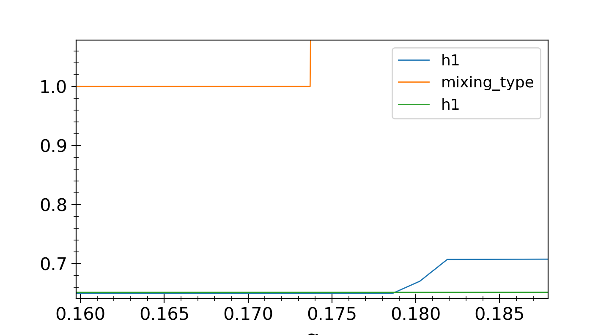
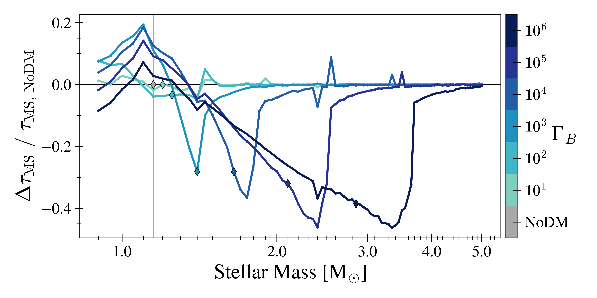
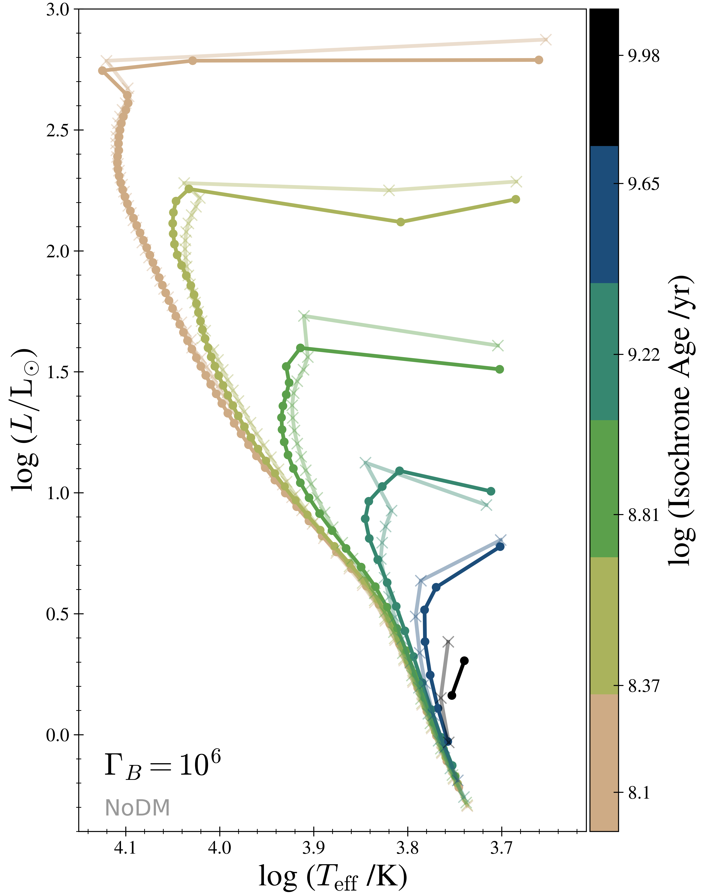
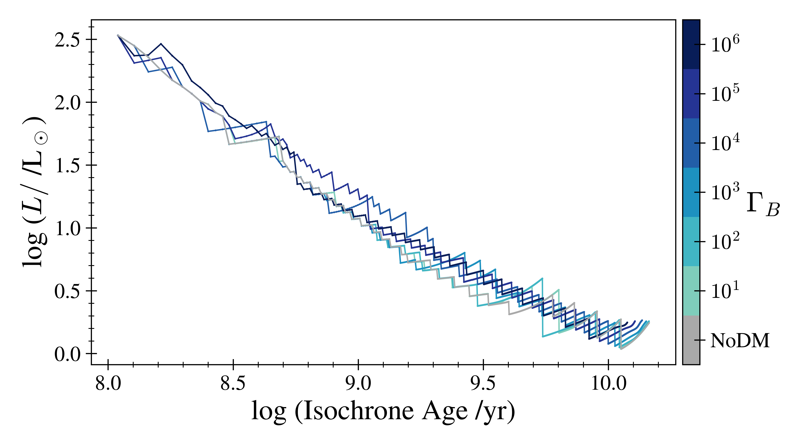
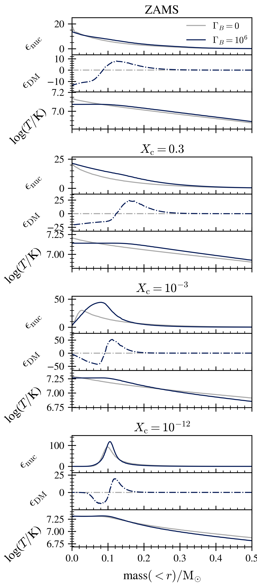

- [Create a DMS Conda env on Osiris](#condaenv)
- [Installs for `pyplot` `usetex`](#latex)
- [Create derived data files](#deriveddata)
    - [`history_pruned.data`](#prunehist)
    - [`descDF.csv`](#descdf)
    - [`hotTeff.csv`](#hotTcsv)
    - [`isochrones.csv`](#isocsv)
    - [`mdf.csv`](#mdfcsv) 
    - [Do some checks](#checks)
- [Check things that seem weird in plots below](#bugs)
    - [MS lifetimes vs Mass](#MStauVsMass)
    - [Xc as fnc of time](#XcVsTime)
    - [Look at 2.4c0 and 2.55c4 (which are the most obvious problems)](#probmod_profiles)
- [Create Raen2020 paper plots](#makeplots)
    - [delta MS Tau](#mstau)
    - [Teff v Age](#teff)
    - [HR Tracks](#tracks)
    - [Isochrones](#isos)  
    - [Hottest MS Teff](#hotT)
    - [3.5 Msun profiles](#3p5)
    - [1.0 Msun profiles](#1p0)


<a name="condaenv"></a>
# Create a DMS Conda env on Osiris
```bash
conda create -n DMS python=3.7 numpy pandas ipython matplotlib astropy scipy
```

<a name="deriveddata"></a>
# Create derived data files
<!-- fs  -->


# Move models that I will be using in final plots to a different directory.
<!-- fs -->
if (mass>0.89 and mass%0.05==0) and (cb, mass) not in problem_mods:
    move to RUNS_FINAL
Get problem_mods from \_defDM/main.md, section # Data Review - runs (mostly) complete, comment # Find problem_mods:

```python
from pathlib import Path
import data_proc as dp
import plot_fncs as pf
import pandas as pd
import os

problem_mods = [(1, 1.05), (1, 2.55), (2, 1.05), (2, 1.1), (2, 1.2), (2, 1.6),
                (2, 2.65), (3, 2.25), (4, 1.55), (4, 2.3), (5, 1.25), (5, 1.9)]

oldPath = Path(pf.mesaruns+ '/RUNS_defDM')
newPath = Path(pf.mesaruns+ '/RUNS_FINAL')

for cb in range(7):
    os.mkdir(newPath / f'c{cb}')

for massdir, mass, cb in dp.iter_starModel_dirs(oldPath):
    move = True
    if mass < 0.90: move = False
    if int(str(massdir)[-1])%5 != 0: move = False
    if (cb, mass) in problem_mods: move = False
    if move:
        dnew = newPath / f'c{cb}' / massdir.name
        os.rename(massdir,dnew)
```
<!-- fe -->


<a name="prunehist"></a>
## Create `history_pruned.data` files
<!-- fs -->

Prune `history.data` files according to `data_proc.prune_hist()`

To use the pruned files in future code, set `usepruned=True` at the top of each file
    - `gen_descDF_csv.py`
    - `plot_fncs.py`
    - `isoScripts/hdat_clean.py`

```python
from pathlib import Path
import data_proc as dp
import plot_fncs as pf

# iterate over all model dirs and prune the `history.data` file, creating `history_pruned.data`
# currently_running = [(0.95,6), (2.43,0)] # (mass, cb), skip these
rootPath = Path(pf.datadir)
for massdir, mass, cb in dp.iter_starModel_dirs(rootPath):
# if (mass,cb) in currently_running: continue
LOGSdir = massdir / 'LOGS'
dp.prune_hist(LOGSdir, skip_exists=False, ow_exists=True)

# add prune by variable changes
LOGSdir = Path(pf.datadir + '/c6/m2p00/LOGS')
dp.prune_hist(LOGSdir, skip_exists=False, ow_exists=True)

# check a c6 model
hpath = LOGSdir / 'history.data'
hdf = dp.load_history(hpath)
hpath = LOGSdir / 'history_pruned.data'
hdfprun = dp.load_history(hpath)

plt.figure()
ax = plt.gca()
for i, (lbl, h) in enumerate({'full': hdf, 'pruned': hdfprun}.items()):
    colors = ['g','b']
    quargs= {   'label':lbl, 'ax':ax, 'kind':'scatter', 'alpha':0.5,
                'color':colors[i]
                }
    h.plot('log_Teff','log_L', **quargs)
plt.title(f'{LOGSdir}')
plt.tight_layout()
plt.savefig(pf.plotdir + '/checkprun_HR.png')
# This looks good

# Generated `history_pruned.data` with care_cols fractional change > 1%
# and `history_pruned_0.001.data` with care_cols fractional change > 0.1%
# File sizes of `history_pruned_0.001.data` look sufficiently small
# => change file names so that `history_pruned.data` is the 0.1% version
tpath = Path('/Users/troyraen/Osiris/DMS/mesaruns/RUNS_defDM/c5/m1p15/LOGS/history_pruned_0.001.data')
target = Path('/Users/troyraen/Osiris/DMS/mesaruns/RUNS_defDM/c5/m1p15/LOGS/history_pruned_test.data')
tpath.rename(target)

rootPath = Path(pf.datadir)
for massdir, mass, cb in dp.iter_starModel_dirs(rootPath):
    h1_old = massdir / 'LOGS' / 'history_pruned.data'
    h1_new = massdir / 'LOGS' / 'history_pruned_0.01.data'
    hp1_old = massdir / 'LOGS' / 'history_pruned_0.001.data'
    hp1_new = massdir / 'LOGS' / 'history_pruned.data'

    if h1_old.is_file():
        h1_old.rename(h1_new)

    if hp1_old.is_file():
        hp1_old.rename(hp1_new)
```
<!-- fe ## Create `history_pruned.data` files -->


<a name="descdf"></a>
## Create `descDF.csv`
<!-- fs -->
Staring with old code in `../../Glue/data_proc.py` and moving necessary items to `gen_descDF_csv.py` and `data_proc.py`.

__Install `py_mesa_reader`__ so this works:
```bash
# Install `mesa_reader`
conda activate DMS
cd DMS
git clone git@github.com:wmwolf/py_mesa_reader.git
cd py_mesa_reader
pip install .
# pip uninstall mesa_reader
```

Once the above is completed (including [pruning history files](#prunehist)), __generate `descDF.csv`__:
```bash
cd ~/DMS/mesaruns_analysis/_Paper/figures
# WARNING: this uses `history_pruned.data` files only
python gen_descDF_csv.py
```

<!-- Need columns:
    - [ ]  Index: `star_index`
    - [ ]  cboost
    - [ ]  mass
    - [ ]  masscc_avg
    - [ ]  MStau
    - [ ]  TACHeB_model -->
<!-- fe ## Create `descDF.csv` -->


<a name="hotTcsv"></a>
## Create `hotTeff.csv`
<!-- fs -->
```python
%run plot_fncs
# get the data
hotT_data = get_hotT_data(data_dir=datadir+'/', age_range=(10**7.75,10**10.25))
# write the file
hotT_data.to_csv(datadir+'/hotTeff.csv')
```
<!-- fe ## Create `hotTeff.csv` -->


<a name="isocsv"></a>
## Create `isochrones.csv`
<!-- fs -->
Starting from instruction and scripts in `DMS/isomy-r10398/scripts` and `DMS/isomy-r10398/glue` and moving necessary stuff to dir `isoScripts` (in same directory as this `main.md`).

- [x]  clone new version of MIST code `git clone git@github.com:aarondotter/iso.git DMS/isomy`
- [x]  generate MIST input history files from `history_pruned.data` stripped of non-essential columns and stored in iso dir (`isoScripts/hdat_clean.py`)
- [x]  copy `history_columns.list` to `isomy` and comment out non-essential columns
- [x]  generate the iso input files (`genisoinput.sh`)
- [x]  make eep and iso
- [x]  combine output to csv (`convert_iso_file.py`)

```python
import subprocess
from isoScripts import hdat_clean as hc
import data_proc as dp
import plot_fncs as pf

# copy history files to isomy dir
mesa_datadir = Path(pf.datadir) # mesa output files
iso_datadir = Path('/home/tjr63/DMS/isomy/data/tracks') # history files placed in tracks/c{cb} dir
hc.write_hdat_files_for_MIST(mesa_datadir, iso_datadir, dp.iter_starModel_dirs)
```

```bash
# generate the iso input files and run make_eep and make_iso
# check the isodir in genisoinput.sh before running this
cd ~/DMS/mesaruns_analysis/_Paper/figures/isoScripts
for cb in $(seq 0 6); do
    ./genisoinput.sh ${cb} '~/DMS/isomy'
done
```

```python
# combine output in DMS/isomy/data/isochrones to csv in pf.datadir
from isoScripts import convert_iso_file as cif
import plot_fncs as pf
cif.iso_to_csv(cboost=[c for c in range(7)], append_cb=True, append_PEEPs=True, isodir='/home/tjr63/DMS/isomy', outdir=pf.datadir)
```
<!-- fe ## Create `isochrones.csv` -->


<a name="checks"></a>
## Do some checks
<!-- fs -->
```python
# check that profiles with priorities have saved the right events
rootPath = Path(pf.datadir)
hdflst = [  dp.load_history(massdir / 'LOGS/history.data', (mass,cb)) \
            for massdir, mass, cb in dp.iter_starModel_dirs(rootPath) if cb<3
            ]
hdf = pd.concat(hdflst)

# find offset in number of models between profile saved and event in hdf
pidf = pf.pidxdfOG.set_index(['mass','cb'])
dfprior = pd.DataFrame(columns=['ZAMS','lAMS','TAMS','TACHeB'], index=hdf.index.unique())
for h in hdflst:
    idx = h.index.unique()
    p = pidf.loc[idx,['priority','model_number']]

    zams_hdf = h.loc[h.center_h1<(h.center_h1.iloc[0]-0.0015),'model_number'].min()
    zams_pidf = p.loc[p.priority==99,'model_number']
    dfprior.loc[idx,'ZAMS'] = zams_hdf - zams_pidf

    lams_hdf = h.loc[h.center_h1<1e-3,'model_number'].min()
    lams_pidf = p.loc[p.priority==95,'model_number']
    dfprior.loc[idx,'lAMS'] = lams_hdf - lams_pidf

    tams_hdf = h.loc[h.center_h1<1e-12,'model_number'].min()
    tams_pidf = p.loc[p.priority==94,'model_number']
    dfprior.loc[idx,'TAMS'] = tams_hdf - tams_pidf

    he_hdf = h.loc[h.center_he4<1e-3,'model_number'].min()
    print(he_hdf)
    he_pidf = p.loc[p.priority==92,'model_number']
    dfprior.loc[idx,'TACHeB'] = he_hdf - he_pidf
dfprior.fillna(0, inplace=True)

# plot histograms
dfprior.hist()
plt.suptitle('histograms of hdf model# - pidf model#')
plt.tight_layout()
plt.savefig(pf.plotdir+'/checkprioritys_hist.png')
```


ZAMS difference likely just due to using different definition in run_star_extras.
Need to be aware of TACHeB.

<!-- fe ## Do some checks -->

<!-- fe # Create derived data files -->

<a name="bugs"></a>
# Check things that seem weird in the plots below
<!-- fs -->
See `probmods.md` where I track models that seem to have problems. The `probmods [dict]` in this file (below) tracks the indices.

Random deviations from the trends in the [delta MS Tau](#mstau) plot seem to be a problem. e.g., c4 at 2.55 Msun has ~10% increase.

- [x]  get (some) affected masses
- [x]  check unpruned history.data from m2.55c4 to see if this is causing the spike (it is not)
- [x]  plot MS lifetimes (not the delta)
- [x]  plot Xc as fnc of time for 3 masses (1 at spike and 2 bracketing it)

Get (some) affected masses (tracked in `probmods.md`)
```python
probmods = {}

for cb in [4,5]:
tmp = descdf.loc[idx[2.3:,cb],'MStau']
print(tmp.loc[tmp.diff()>0.03].index)

probmods['deltaSpike'] = [(2.55,4), (3.35,4), (3.5,5)]
```

<a name="MStauVsMass"></a>
## MS lifetimes vs Mass
<!-- fs -->
```python
%run plot_fncs
descdf = get_descdf(fin=fdesc)
descdf.rename(columns={'cboost':'cb'}, inplace=True)
descdf.set_index(['mass','cb'], inplace=True, drop=False)
pvt = {'index':'mass','columns':'cb','values':'MStau_yrs'}
ddf = descdf.pivot(**pvt)

plt.figure(figsize=(4,16))
args = {'logy':True, 'marker':'o', 'ms':1, 'color':[cbcmap(i) for i in range(7)],
        'subplots':True, 'ax':plt.gca()}
ddf.plot(**args)
plt.ylabel('MS lifetime [yrs]')
plt.tight_layout()
plt.savefig(plotdir+'/check_MStau_yrs.png')
```


The __trend__ has a noticeable increase in c3-6 just due to the shutoff of core convection.

There is an __unexpected increase__ around 2.4Msun in cboost 0-3, and it's pushed to higher masses in cboost 4 and 5. Get affected masses and check center_h1.

Get affected masses:
```python
for cb in ddf.columns:
    dif = ddf[cb].dropna().diff() # difference with the previous row, should be negative
    for mass in dif.loc[dif>0].index.tolist():
        print(f'({mass}, {cb})') # get positive (problem) value indicies

probmods['msIncPrevMass'] = [(2.4, 0), (2.4, 1), (2.4, 2), (2.4, 3), (2.55, 4), (3.5, 5)]
```
__Problem models__ are:
(2.4, 0)
(2.4, 1)
(2.4, 2)
(2.4, 3)
(2.55, 4)
(3.5, 5)

Models that increase predictably, due to DM shutting off core convection:
(3, 1.45)
(4, 1.8)
(4, 1.85)
(5, 2.45)
(5, 2.5)
(5, 2.55)
(6, 3.5)
(6, 3.6)
(6, 3.65)
(6, 3.7)

<!-- fe  -->

<a name="XcVsTime"></a>
## Xc as fnc of time:
<!-- fs -->
```python
%run plot_fncs
from pandas import IndexSlice as idx
import debug_fncs as dbg

# get a center_h1 vs age df as a pivot table
mass, cb = [2.35, 2.40, 2.45, 2.50, 2.55, 2.60], 4 # model 2.40 has dip, 2.55 has spike
hp = dbg.get_h1_v_age_pivot(mass,cb)
# plot it
hp.plot()
plt.xlim(0,6e8)
plt.ylabel('center_h1')
plt.title('c4 models')
plt.tight_layout()
plt.show(block=False)
plt.savefig(plotdir+'/check_MStau_centerh1_linear.png')

pmlist = list(set(sum(probmods.values(), [])))
minage = 1e7
H1cInc = []
fig, axs = plt.subplots(nrows=len(pmlist),ncols=1, sharex=True, figsize=(5,12))
for a, ix in enumerate(pmlist):
    (mass,cb) = ix
    h = get_hdf(cb, mass=mass)
    h = h.loc[h.star_age>minage,:]
    axs[a].semilogx(h.star_age, h.center_h1, label=f'({mass}, {cb})')
    axs[a].legend()
    plt.ylabel('center_h1')
    if h.center_h1.is_monotonic_decreasing == False:
        H1cInc.append(ix)
plt.xlabel('star_age')
plt.tight_layout()
plt.savefig(plotdir+'/check_centerH1.png')
probmods['H1cInc'] = H1cInc

```


<!-- __Note the increases in the `m2.55c4` and `m2.40c0` models at early times.__ -->
<!-- I looked at a loglog plot to see where each model fell below 1e-3 (end of MS) and the pattern is the same as seen here. -->

Get a list of models that have non-monotonic center_h1 values before they hit TAMS.
<!-- (Note that loglog plots above showed center_h1 increases after TAMS at very small values < ~1e-30.) -->

```python
h1cut = 1e-12
rootPath, nonmono = Path(datadir), pd.DataFrame(columns=['mass','cb','h1_mono'])
for massdir, mass, cb in dp.iter_starModel_dirs(rootPath):
    masscb = (mass,cb)
    hdf = get_hdf(cb, mass=mass)
    mono = hdf.loc[hdf.center_h1>h1cut,'center_h1'].is_monotonic_decreasing
    nonmono = nonmono.append({'mass':mass,'cb':cb,'h1_mono':mono},ignore_index=True)

len(nonmono)
len(len(nonmono.loc[nonmono.h1_mono==False,:]))
nonmono.loc[nonmono.h1_mono==False,:]
```

- [ ]  __There are 93 (out of 569) models for which center_h1 is non-monotonic before TAMS. Need to track down why. This seems to cause the other problems found above.__ Only physically plausible mechanism I can think of that may increase central H1 abundance is convection, but that shouldn't affect a single mass and not the masses that bracket it in the way seen in the center_h1 plots above.

<!-- fe  -->

<a name="probmod_profiles"></a>
## Look at 2.4c0 and 2.55c4 (which have the most noticeable affects)
<!-- fs -->

### Look at the 2.4c0 model more closely:
<!-- fs -->
```python
%run plot_fncs
cb, mass = 0, 2.40
hdf = get_hdf(cb, mass=mass) # plot_fncs.py usepruned = True
hdfunp = get_hdf(cb, mass=mass) # usepruned = False
# len(hdf) = 880, len(hdfunp) = 881
hdfb = get_hdf(cb, mass=mass-0.05)

h1cut = 1e-12
hdf.loc[hdf.center_h1>h1cut,'center_h1'].is_monotonic_decreasing # False
hdfb.loc[hdfb.center_h1>h1cut,'center_h1'].is_monotonic_decreasing # True

hdf = hdf.loc[hdf.center_h1>h1cut,:]

import matplotlib as mpl
from matplotlib import pyplot as plt
hdf.plot('model_number', 'center_h1', kind='scatter')
plt.show(block=False)
# model 284 has the only increase
pm = 284
hdf.loc[hdf.model_number>pm,'center_h1'].is_monotonic_decreasing # True
hdf.loc[hdf.model_number<pm,'center_h1'].is_monotonic_decreasing # True

h = hdf.loc[((hdf.model_number>225)&(hdf.model_number<325)),:]

# scale energy error to see on same plot
h['log_reiec'] = np.log10(h.rel_error_in_energy_conservation.abs())/13
plotcols = ['center_h1','center_he4','mass_conv_core','total_mass_h1','log_reiec']
h.plot('model_number', plotcols)
plt.gca().axvline(pm, c='0.5', lw=0.25)
plt.title(rf'2.4M$_\odot$ c0')
plt.tight_layout()
plt.show(block=False)
plt.savefig(plotdir+'/m2p4c0.png')

# look at mixing
plotcols = ['mass_conv_core','conv_mx1_top','conv_mx1_bot','conv_mx2_top','conv_mx2_bot','mx1_top', 'mx1_bot']
h.plot('model_number', plotcols)
plt.gca().axvline(pm, c='0.5', lw=0.25)
plt.title(rf'2.4M$_\odot$ c0')
plt.tight_layout()
plt.show(block=False)
plt.savefig(plotdir+'/m2p4c0_mixing.png')

```


__Problem model number = 284 (thin grey line)__

- [x]  I looked at `STD.out` for this model and there is no entry for model number 284 (skips from model 270 to 287), indicating that there was no problem with this step.
- [ ]  __Some type of non-convective mixing turns on in the core at this step. What kind of mixing is it?__

### Do another 2.4c0 run and save video
```bash
maindir="/home/tjr63/DMS/mesaruns_x"
cd ${maindir}
./clean
./mk

RUNS="RUNS"
source ${maindir}/bash_scripts/do_mesa_run.sh
# source ${maindir}/images_to_movie.sh # the call to this script fails
mass=m2p4
mval=2.40
cb=0
do_mesa_run "${maindir}" "${RUNS}/c${cb}/${mass}" "${mval}" "${cb}" 1 "master" 1
mv "${RUNS}/c${cb}/${mass}" "${RUNS}/c${cb}/${mass}_png"
```
Didn't show anything obviously useful.

### Do another run and save profiles for models 280-285.
```bash
# edit src/run_star_extras.f to save profiles
do_mesa_run "${maindir}" "${RUNS}/c${cb}/${mass}" "${mval}" "${cb}" 0 "master" 1

cd _Paper/figures
dmsenv
ipython
```

```python
import pandas as pd
from matplotlib import pyplot as plt
%run plot_fncs
pidx = pidxdfOG
# load the profiles
cb, mass = 0, 2.40
pm = 284 # problem model where center_h1 increases
modnum = [pm+i for i in [-2,-1,0,1]]
pdflist = []
for mn in modnum:
    pdf = get_pdf(cb, mn, mass=mass)
    pdf['massi'], pdf['cb'], pdf['modnum'] = mass, cb, mn
    pdflist.append(pdf.set_index(['modnum','zone'], drop=False))
pdf = pd.concat(pdflist)

# mixingcols = ['mixing_type', 'log_D_mix', 'log_D_conv', 'log_D_soft', 'log_D_semi',
#             'log_D_ovr', 'log_D_thrm', 'log_D_minimum', 'log_D_rayleigh_taylor',
#             'log_D_anon']
# I checked all of those. The interesting one is
mixingcols = ['mixing_type', 'h1']

for col in mixingcols:
    plt.figure()
    for mn, p in pdf.groupby(level='modnum'):
        args = {'ax':plt.gca(), 'label':f'model {mn}'}
        p.plot('q',col, **args)
    plt.title(f'{col} m2p4c0')
    plt.ylabel(col)
    plt.legend()
    plt.tight_layout()
    plt.show(block=False)
    plt.savefig(plotdir+f'/m2p4c0_{col}_profiles.png')

```


Mixing types from mesa-r12115/const/public/const_def.f90:
- no_mixing = 0
- convective_mixing = 1
- softened_convective_mixing = 2  ! for modified D_mix near convective boundary
- overshoot_mixing = 3
- semiconvective_mixing = 4
- thermohaline_mixing = 5
- rotation_mixing = 6
- rayleigh_taylor_mixing = 7
- minimum_mixing = 8
- anonymous_mixing = 9

Model numbers 284 and 285 have rotation mixing in q = [0.2, 0.4], while the previous models have no mixing in that region.


```python
# plot h1 and mixing type together for model 284
from pandas import IndexSlice as idx
plt.figure()
args = {'ax':plt.gca()}
pdf.loc[idx[pm-1,:],:].plot('q','h1', **args)
pdf.loc[idx[pm,:],:].plot('q',mixingcols, **args)
plt.show(block=False)
# zoom in and save manually
```
This confirms that the inner edge of the rotational mixing zone extends into the core region where h1 was previously depleted. Blue is h1 profile from model 283, orange and green are from model 284.



<!-- fe ## Look at the 2.4c0 model more closely: -->

### Look at the 2.55c4 model more closely:
<!-- fs -->
Plots below show similar patterns to 2.4c0 plots above.

```python
%run plot_fncs
cb, mass = 4, 2.55
hdf = get_hdf(cb, mass=mass) # plot_fncs.py usepruned = True
hdfunp = get_hdf(cb, mass=mass) # usepruned = False
# len(hdf) = 828, len(hdfunp) = 828

h1cut = 1e-12
hdf.loc[hdf.center_h1>h1cut,'center_h1'].is_monotonic_decreasing # False

hdf = hdf.loc[hdf.center_h1>h1cut,:]

hdf.plot('model_number', 'center_h1', kind='scatter')
plt.show(block=False)
# model 286 has the only increase
pm = 286
hdf.loc[hdf.model_number>pm,'center_h1'].is_monotonic_decreasing # True
hdf.loc[hdf.model_number<pm,'center_h1'].is_monotonic_decreasing # True

h = hdf.loc[((hdf.model_number>225)&(hdf.model_number<325)),:]

# scale energy error to see on same plot
h['log_reiec'] = np.log10(h.rel_error_in_energy_conservation.abs())/13
plotcols = ['center_h1','center_he4','conv_mx1_top','total_mass_h1','log_reiec']
h.plot('model_number', plotcols)
plt.gca().axvline(pm, c='0.5', lw=0.25)
plt.title(rf'2.55M$_\odot$ c4')
plt.tight_layout()
plt.show(block=False)
plt.savefig(plotdir+'/m2p55c4.png')


plotcols = ['mass_conv_core','conv_mx1_top','conv_mx1_bot','conv_mx2_top','conv_mx2_bot',
            'mx1_top', 'mx1_bot']
h.plot('model_number', plotcols)
plt.gca().axvline(pm, c='0.5', lw=0.25)
plt.title(rf'2.55M$_\odot$ c4')
plt.tight_layout()
plt.show(block=False)
plt.savefig(plotdir+'/m2p55c4_mixing.png')
```


__Problem model number = 286 (thin grey line)__

### Do another run and save profiles for models 282-287.
```bash
# edit src/run_star_extras.f to save profiles
maindir="/home/tjr63/DMS/mesaruns_x"
cd ${maindir}
# edit src/run_star_extras.f to save profiles
./clean
./mk

RUNS="RUNS"
source ${maindir}/bash_scripts/do_mesa_run.sh
# source ${maindir}/images_to_movie.sh # the call to this script fails
mass=m2p55
mval=2.55
cb=4

do_mesa_run "${maindir}" "${RUNS}/c${cb}/${mass}" "${mval}" "${cb}" 0 "master" 1

cd _Paper/figures
dmsenv
ipython
```

```python
import pandas as pd
from matplotlib import pyplot as plt
%run plot_fncs
pidx = pidxdfOG
# load the profiles
cb, mass = 4, 2.55
pm = 286 # problem model where center_h1 increases
modnum = [pm+i for i in [-2,-1,0,1]]
pdflist = []
for mn in modnum:
    pdf = get_pdf(cb, mn, mass=mass)
    pdf['massi'], pdf['cb'], pdf['modnum'] = mass, cb, mn
    pdflist.append(pdf.set_index(['modnum','zone'], drop=False))
pdf = pd.concat(pdflist)

mixingcols = ['mixing_type', 'h1']

for col in mixingcols:
    plt.figure()
    for mn, p in pdf.groupby(level='modnum'):
        args = {'ax':plt.gca(), 'label':f'model {mn}'}
        p.plot('q',col, **args)
    plt.ylabel(col)
    plt.title(f'{col} m2p55c4')
    plt.legend()
    plt.tight_layout()
    plt.show(block=False)
    plt.savefig(plotdir+f'/m2p55c4_{col}_profiles.png')
```


Similar to m2p4c0 above, rotation mixing in q = [0.2, 0.4] turns on at the problem model.

<!-- fe ## Look at the 2.55c4 model more closely: -->

<!-- fe # Look at 2.4c0 and 2.55c4 (which have the most noticeable affects)  -->

<!-- fe # Check things that seem weird in plots below -->

<a name="makeplots"></a>
# Create plots for Raen2020 paper
<!-- fs plots -->

- Osiris
- `defDM` branch
- `home/tjr63/DMS/mesaruns_analysis/_Paper/figures/` (Osiris) directory


### setup and testing
<!-- fs -->
```python
%run plot_fncs
pidf = pidxdfOG # df of profiles.index files
cb, mass = 0, 1.0
modnum = pidf.loc[((pidf.mass==mass)&(pidf.cb==cb)&(pidf.priority==97)),'model_number'].iloc[0]
# hdf = load_hist_from_file(0, mass=1.0, from_file=True, pidxdf=pidf) # 1p0c0 history df
hdf = get_hdf(cb, mass=mass) # single history df
pdf = get_pdf(cb, modnum, mass=mass, rtrn='df') # single profile df
```

Note that there is a problem in matplotlib version 3.1.3
when trying to use a colormap with a scatter plot and data of length 1
See https://github.com/matplotlib/matplotlib/issues/10365/
I fixed this in `plot_delta_tau()` and other fncs below by doing
`plt.scatter(np.reshape(x,-1), np.reshape(y,-1), c=np.reshape(c,-1))`

<!-- fe -->


<a name="mstau"></a>
### delta MS Tau
<!-- fs -->
```python
descdf = get_descdf(fin=fdesc)
save = [None, plotdir + '/MStau.png', finalplotdir + '/MStau.png']
plot_delta_tau(descdf, cctrans_frac='default', which='avg', save=save[1])
```



#### Debug:
[See above](#bugs) for exploration/explanation of the random deviations from the trends (due to rotational mixing -> injecting h1 into center)

Check how much hydrogen is being burned, relative to c0 model of same mass.
- [x]  Update `data_proc.py` to find Hburned = (c6hburn - c0hburn)/c0hburn and regenerate `descDF.csv`

```python
from matplotlib import pyplot as plt

%run plot_fncs
descdf = get_descdf(fin=fdesc)

pvt = {'index':'mass','columns':'cboost','values':'Hburned'}
dpiv = descdf.pivot(**pvt)
plt.set_cmap(cbcmap)
args = {'cmap':cbcmap}
dpiv.plot(**args)
plt.legend(loc=4)
plt.ylabel('(Hburned - Hburned_c0)/Hburned_c0', fontsize=12)
plt.tight_layout()
save = plotdir + '/Hburned.png'
plt.savefig(save)
```


<!-- fe -->


<a name="teff"></a>
### Teff v Age
<!-- fs -->
```python
mlist = [1.0, 2.0, 3.5,]# ,0.8, 5.0]
cblist = [4, 6]
from_file = [False, get_r2tf_LOGS_dirs(masses=mlist, cbs=cblist+[0])]
                    # Only need to send this dict once.
                    # It stores history dfs in dict hdfs (unless overwritten)
save = [None, plotdir+'/Teff.png', finalplotdir+'/Teff.png']
plot_Teff(mlist=mlist, cblist=cblist, from_file=from_file[1], descdf=descdf, save=save[1])
```


#### Debug:

- [x]  start ages = 0 at ZAMS (had to fix `start_center_h1` value in `get_h1cuts()`)
- [x]  why does lifetime difference in 1Msun look bigger than in 2Msun (contradicting MStau plot)? (it is deceiving, see plots below... or __perhaps delta MS tau is deceiving?__)


Grey lines mark Teff at leaveMS of NoDM models (thin line), blue lines mark same for c6 models (thick line). Difference in MS lifetime of 2.0Msun models is greater than for 1.0Msun models.

Problems:
- [ ]  In 2Msun models (top row), c6 model lives __longer__ than the NoDM model which is opposite of delta MS tau plot. Something is wrong here.
- [ ]  Difference in MS lifetime between 2Msun models is more like 10% than 20%

```python
descdf = get_descdf(fin=fdesc)
descdf.set_index(['mass','cboost'],inplace=True)
mass, massstr, cb = 1.00, 'm1p00', 0
hpath = Path(datadir) / f'c{cb}' / f'{massstr}' / 'LOGS' / 'history_pruned.data'
hdf = dp.load_history(hpath)
# h = cut_HR_hdf(hdf, cuts=['ZAMS','TACHeB'], tahe=[descdf,mass,cb])
h = cut_HR_hdf(hdf, cuts=['ZAMS','H-3'])

np.log10(h.star_age.max() - h.star_age.min())
np.log10(descdf.loc[idx[mass,cb],'MStau_yrs'])
```
- [x]  __Note that the MS lifetimes I get from h (9.886) and descdf (9.897) above do not match.__ Need to track down why. (Fixed. I was not including the leaveMS model in the `cut_HR_hdf` for h.)

<!-- fe -->


<a name="tracks"></a>
### HR Tracks
<!-- fs -->
```python
mlist = [1.0, 2.0, 3.5,]# ,0.8, 5.0]
cblist = [4, 6]
from_file = [False, True, get_r2tf_LOGS_dirs(masses=mlist, cbs=cblist+[0])]
                        # Only need to send this dict once.
                        # It stores history dfs in dict hdfs (unless overwritten)
save = [None, plotdir+'/tracks.png', finalplotdir+'/tracks.png']
plot_HR_tracks(mlist=mlist, cblist=cblist, from_file=from_file[2], descdf=descdf,
                  save=save[1])
```


#### Debug:

- [x]  remove pre-ZAMS portion
- [ ]  why is the NoDM leave MS line not smooth?

plot MStau - MStau of previous mass (should be negative)
```python
descdf = get_descdf(fin=fdesc).sort_values('mass').set_index(['mass','cboost'])
d0 = descdf.loc[idx[:,0],:]
dif = np.log10(d0.MStau_yrs).diff()#.dropna()
plt.figure()
plt.plot(d0.reset_index().mass, dif, '-o')
plt.axhline(0,c='k')
plt.xlabel('star mass')
plt.ylabel('log10 MStau[mass[i]] - \nlog10 MStau[mass[i-1]]',fontsize=12)
plt.tight_layout()
plt.show(block=False)
plt.savefig(plotdir+'/check_HR_MStau_c0.png')
```


- Only 2.4Msun model lives longer than previous mass (identified in [delta MSTau](#mstau) debugging above.)
- I think the bouncing around at the end is just due to the irregularly space masses (4.0, 4.03, 4.05, 4.08, ...). Lower masses at .03 and .08 aren't done yet.

Plot T, L, MStau to look for high mass problem models
```python
d = d0.reset_index().set_index('mass')
d['logMStau/max'] = np.log10(d.MStau_yrs)/np.log10(d.MStau_yrs.max())
d['lAMS_logTeff/max'] = d.lAMS_Teff/d.lAMS_Teff.max()
d['lAMS_logL/max'] = d.lAMS_L/d.lAMS_L.max()
args = {'marker':'o', 'ms':3}
d.loc[idx[3.4:],['lAMS_logTeff/max', 'lAMS_logL/max', 'logMStau/max']].plot(**args)
plt.grid(which='both')
plt.tight_layout()
plt.show(block=False)
plt.savefig(plotdir+'/check_HR_lAMS_c0.png')
```


If I zoom in real close it looks like the spikes might be due to slightly increased MS lifetimes. Check timestep resolution for center_h1.

```python
import debug_fncs as dbg
import data_proc as dp
# get a center_h1 vs age df as a pivot table
mass, cb = [4.93], 0 # 4.93 is the last spike
hp = dbg.get_h1_v_age_pivot(mass,cb)
# get the same for the unpruned history file
hdf = dp.load_history(datadir+'/c0/m4p93/LOGS/history.data')
hdf['mass'] = '4.93 unpruned'
pvt = {'index':'star_age','columns':'mass','values':'center_h1'}
hpup = hdf.pivot(**pvt)

# plot them
plt.figure()
ax = plt.gca()
args = {'marker':'o', 'ms':5, 'loglog':True, 'ax':ax}
hp.plot(**args)
args['ms'] = 3
hpup.plot(**args)
plt.axhline(1e-3, c='0.5', lw=0.5)
plt.ylabel('center_h1')
plt.title('c0 models')
plt.tight_layout()
plt.show(block=False)
plt.savefig(plotdir+'/check_HR_centerh1_4p93.png')

```


The datapoint that intersects the 1e-3 line is actually slightly above it (I zoomed in to check). Therefore the leaveMS model is much closer to 1e-4. Since Teff changes so quickly during this time, it is conceivable that this causes the spike in the leaveMS line. Check plot (todo, below) to be sure. The issue is not caused by the pruned history file. I also checked 3.93Msun which has a similar issue.

- [ ]  plot Teff v age and L v age for (4.90, 4.93, 4.95)Msun. star leaveMS model. see if using previous model for 4.93 would smooth the curve.
- [ ]  consider smoothing this out by either interpolating using `hdf.interpolate` or just using the Teff of the previous model since it's closest to center_h1 condition

<!-- fe -->


<a name="isos"></a>
### Isochrones
<!-- fs -->
```python
isodf = load_isos_from_file(fin=iso_csv, cols=None)
isoages = get_iso_ages(isodf)
plot_times = [age for i,age in enumerate(isoages) if i%4==0][3:]
print(plot_times)
# plot_times = [8.284, 8.4124, 8.8618, 9.1828, 9.4396, 9.6964, 9.9532, 10.017400000000002]
# plot_times = [7.0, 7.3852, 7.642, 7.8346, 8.0272, 8.155599999999998]
cb = [4, 6]
for c in cb:
    save = [None, plotdir+'/isos_cb'+str(c)+'.png', \
            finalplotdir+'/isos_cb'+str(c)+'.png']
    plot_isos_ind(isodf, plot_times=plot_times, cb=c, save=save[1])
```




#### Debug:

- [ ]  `isochrone_c0.dat` only has masses between 2-3Msun and no isochrones older than 10^8.93. Wondering if I haven't run a fine enough mass grid. Previous results used [.0, .03, .05, .08].
    - [ ]  Try running more c0s.
    - [ ]  take old data and down sample mass grid, re-generate isochrones and see if get the same problem.
    - [ ]  what is the oldest isochrone I want to show in c6 models, run finer mass grid only for c0,4,6 and stop them when reach age > oldest isochrone
<!-- fe -->


<a name="hotT"></a>
### Hottest MS Teff
<!-- fs -->
```python
save = [None, plotdir+'/hotTeff.png', finalplotdir+'/hotTeff.png']
plot_hottest_Teff(plot_data=hotTeff_csv, save=save[1], resid=False)
```


- [ ]  rerun when all models have completed

Plot log L of hottest MS star to see what it looks like:
```python
save = [None, plotdir+'/hotL.png', finalplotdir+'/hotL.png']
plotL = True
plot_hottest_Teff(save=save[1], plot_data=hotTeff_csv, resid=False, plotL=plotL)
```


<!-- fe -->


<a name="3p5"></a>
### 3.5 Msun profiles
<!-- fs -->
```python
# cbmods = get_h1_modnums(mass=3.5)
# print(cbmods)
peeps = [ 'ZAMS', 'IAMS', 'H-3', 'H-4' ]
save = [None, plotdir+'/m3p5.png', finalplotdir+'/m3p5.png']
h1_legend = [False, True]
plot_m3p5(peeps=peeps, h1_legend=h1_legend[1], save=plotdir+'/m3p5_legend.png')
plot_m3p5(peeps=peeps, h1_legend=h1_legend[0], save=save[1])
```


#### Debug:

- [ ]  last two profiles are at the wrong times. the correct profiles did not get saved. run models again.
    - profile for h1_center<1e-4 was not set to be saved in `run_star_extras.f`. Not sure why h1_center<1e-3 didn't save. can find the model numbers from `hdf` and save profiles that way.

```python
from pandas import IndexSlice as idx
import debug_fncs as dbg

h1cuts, __ = get_h1cuts()
moddic = {}
mass, cb = 3.5, [0,6]
for c in cb:
    print(c, hdf.model_number.max())
    moddic[c] = {}
    hdf = get_hdf(c, mass=mass).sort_values('model_number')
    for name, cut in h1cuts.items():
        m = hdf.loc[hdf.center_h1<cut,'model_number'].min()
        moddic[c][name] = m
```

Update run_star_extras to save model numbers in moddic, then re-run these two models.
```bash
maindir="/home/tjr63/DMS/mesaruns"
cd ${maindir}
nano src/run_star_extras.f
# Update run_star_extras to save model numbers in moddic
./clean
./mk
RUNS="RUNS_FINAL_tmp"
source ${maindir}/bash_scripts/do_mesa_run.sh
# source ${maindir}/images_to_movie.sh # the call to this script fails
mass=m3p50
mval=3.50
cb=0
do_mesa_run "${maindir}" "${RUNS}/c${cb}/${mass}" "${mval}" "${cb}" 0 "master" 0

RUNSfinal="RUNS_FINAL"
RUNSdefDM="RUNS_defDM"
mass=m3p50
mv "${RUNSfinal}/c${cb}/${mass}" "${RUNSdefDM}/c${cb}/${mass}"
mv "${RUNS}/c${cb}/${mass}" "${RUNSfinal}/c${cb}/${mass}"
# repeat for cb=6

cd
cd DMS/mesaruns_analysis/_Paper/figures/
dmsenv
ipython
```

Prune the new history files
```python
from pathlib import Path
import data_proc as dp
import plot_fncs as pf
rootPath = Path(pf.datadir)
for cb in [0,6]:
    LOGSdir = Path(pf.datadir + f'/c{cb}/m3p50/LOGS')
    dp.prune_hist(LOGSdir, skip_exists=False, ow_exists=True)
```
Now the above plots should have the correct data.

#### Check that temp profile is flattened
```python
# alter plot_fncs plot_m3p5() to show T instead of convection
save = plotdir+'/m3p5_temp_profiles.png'
plot_m3p5(peeps=peeps, h1_legend=False, save=save)
```

It is flattened.

<!-- fe -->


<a name="1p0"></a>
### 1.0 Msun profiles
<!-- fs -->
The old plots for 1Msun models are no longer relevant. I think something like this would be better.

```python
peeps = [ 'ZAMS', 'IAMS', 'H-3', 'TAMS']
save = [None, plotdir+'/m1p0.png', finalplotdir+'/m1p0.png']
plot_m1p0(peeps=peeps, h1_legend=True, save=plotdir+'/m1p0_h1Legend.png')
plot_m1p0(peeps=peeps, h1_legend=False, save=save[1])
```


<!-- fe -->

<!-- fe plots -->
