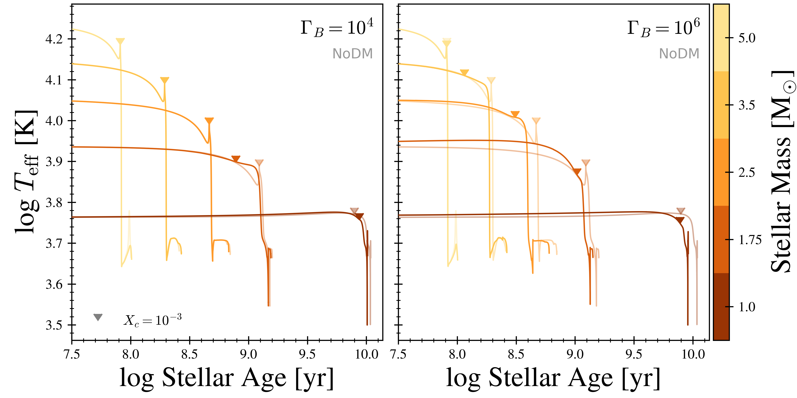
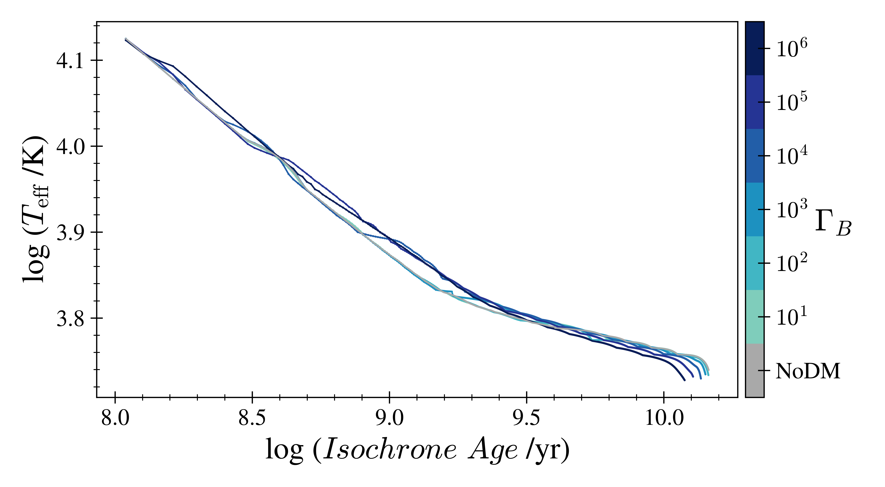

- [Create a DMS Conda env on Osiris](#condaenv)
- [Create derived data files](#deriveddata)
    - [`history_pruned.data`](#prunehist)
    - [`descDF.csv`](#descdf)
    - [`hotTeff.csv`](#hotT)
    - [`isochrones.csv`](#isocsv)
    - [Do some checks](#checks)
- [Create Raen2020 paper plots](#makeplots)
    - [delta MS Tau](#mstau)
    - [Teff v Age](#teff)
    - [HR Tracks](#tracks)
    - [Isochrones](#isos)  
    - [Hottest MS Teff](#hotT)
    - [3.5 Msun profiles](#3p5)
    - [1.0 Msun profiles](#1p0)
    - [Changes made to `RUNS_2test_final` (MESA-r10398) plot code](#r10398Changes)

<a name="condaenv"></a>
# Create a DMS Conda env on Osiris
```bash
conda create -n DMS python=3.7 numpy pandas ipython matplotlib astropy scipy
```

<a name="deriveddata"></a>
# Create derived data files
<!-- fs  -->

<a name="prunehist"></a>
## Create `history_pruned.data` files
<!-- fs -->

Prune `history.data` files according to `data_proc.prune_hist()`

To use the pruned files in future code, set `usepruned=True` at the top of each file
    - `gen_descDF_csv.py`
    - `plot_fncs.py`
    - `isoScripts/hdat_clean.py`

```python
from pathlib import Path
import data_proc as dp
import plot_fncs as pf

# iterate over all model dirs and prune the `history.data` file, creating `history_pruned.data`
currently_running = [(1.40,5), (1.20,5), (1.00,5)] # (mass, cb), skip these
rootPath = Path(pf.datadir)
for massdir, mass, cb in dp.iter_starModel_dirs(rootPath):
    if (mass,cb) in currently_running: continue
    LOGSdir = massdir / 'LOGS'
    dp.prune_hist(LOGSdir, skip_exists=False, ow_exists=True)

# add prune by variable changes
LOGSdir = Path(pf.datadir + '/c6/m2p00/LOGS')
dp.prune_hist(LOGSdir, skip_exists=False, ow_exists=True)

# check a c6 model
hpath = LOGSdir / 'history.data'
hdf = dp.load_history(hpath)
hpath = LOGSdir / 'history_pruned.data'
hdfprun = dp.load_history(hpath)

plt.figure()
ax = plt.gca()
for i, (lbl, h) in enumerate({'full': hdf, 'pruned': hdfprun}.items()):
    colors = ['g','b']
    quargs= {   'label':lbl, 'ax':ax, 'kind':'scatter', 'alpha':0.5,
                'color':colors[i]
                }
    h.plot('log_Teff','log_L', **quargs)
plt.title(f'{LOGSdir}')
plt.tight_layout()
plt.savefig(pf.plotdir + '/checkprun_HR.png')
# This looks good

# Generated `history_pruned.data` with care_cols fractional change > 1%
# and `history_pruned_0.001.data` with care_cols fractional change > 0.1%
# File sizes of `history_pruned_0.001.data` look sufficiently small
# => change file names so that `history_pruned.data` is the 0.1% version
tpath = Path('/Users/troyraen/Osiris/DMS/mesaruns/RUNS_defDM/c5/m1p15/LOGS/history_pruned_0.001.data')
target = Path('/Users/troyraen/Osiris/DMS/mesaruns/RUNS_defDM/c5/m1p15/LOGS/history_pruned_test.data')
tpath.rename(target)

rootPath = Path(pf.datadir)
for massdir, mass, cb in dp.iter_starModel_dirs(rootPath):
    h1_old = massdir / 'LOGS' / 'history_pruned.data'
    h1_new = massdir / 'LOGS' / 'history_pruned_0.01.data'
    hp1_old = massdir / 'LOGS' / 'history_pruned_0.001.data'
    hp1_new = massdir / 'LOGS' / 'history_pruned.data'

    if h1_old.is_file():
        h1_old.rename(h1_new)

    if hp1_old.is_file():
        hp1_old.rename(hp1_new)
```
<!-- fe ## Create `history_pruned.data` files -->


<a name="descdf"></a>
## Create `descDF.csv`
<!-- fs -->
Staring with old code in `../../Glue/data_proc.py` and moving necessary items to `gen_descDF_csv.py` and `data_proc.py`.

__Install `py_mesa_reader`__ so this works:
```bash
# Install `mesa_reader`
conda activate DMS
cd DMS
git clone git@github.com:wmwolf/py_mesa_reader.git
cd py_mesa_reader
pip install .
# pip uninstall mesa_reader
```

Once the above is completed (including [pruning history files](#prunehist)), __generate `descDF.csv`__:
```bash
cd ~/DMS/mesaruns_analysis/_Paper/figures
# WARNING: this uses `history_pruned.data` files only
python gen_descDF_csv.py
```

<!-- Need columns:
    - [ ]  Index: `star_index`
    - [ ]  cboost
    - [ ]  mass
    - [ ]  masscc_avg
    - [ ]  MStau
    - [ ]  TACHeB_model -->
<!-- fe ## Create `descDF.csv` -->


<a name="hotT"></a>
## Create `hotTeff.csv`
<!-- fs -->
```python
%run plot_fncs
# get the data
hotT_data = get_hotT_data(data_dir=datadir+'/', age_range=(10**7.75,10**10.25))
# write the file
hotT_data.to_csv(datadir+'/hotTeff.csv')
```
<!-- fe ## Create `hotTeff.csv` -->


<a name="isocsv"></a>
## Create `isochrones.csv`
<!-- fs -->
Starting from instruction and scripts in `DMS/isomy-r10398/scripts` and `DMS/isomy-r10398/glue` and moving necessary stuff to dir `isoScripts` (in same directory as this `main.md`).

- [x]  clone new version of MIST code `git clone git@github.com:aarondotter/iso.git DMS/isomy`
- [x]  generate MIST input history files from `history_pruned.data` stripped of non-essential columns and stored in iso dir (`isoScripts/hdat_clean.py`)
- [x]  copy `history_columns.list` to `isomy` and comment out non-essential columns
- [x]  generate the iso input files (`genisoinput.sh`)
- [x]  make eep and iso
- [x]  combine output to csv (`convert_iso_file.py`)

```python
import subprocess
from isoScripts import hdat_clean as hc
import data_proc as dp
import plot_fncs as pf

# copy history files to isomy dir
mesa_datadir = Path(pf.datadir) # mesa output files
iso_datadir = Path('/home/tjr63/DMS/isomy/data/tracks') # history files placed in tracks/c{cb} dir
hc.write_hdat_files_for_MIST(mesa_datadir, iso_datadir, dp.iter_starModel_dirs)
```

```bash
# generate the iso input files and run make_eep and make_iso
# check the isodir in genisoinput.sh before running this
cd ~/DMS/mesaruns_analysis/_Paper/figures/isoScripts
for cb in $(seq 0 6); do
    ./genisoinput.sh ${cb} '~/DMS/isomy'
done
```

```python
# combine output in DMS/isomy/data/isochrones to csv in pf.datadir
from isoScripts import convert_iso_file as cif
import plot_fncs as pf
cif.iso_to_csv(cboost=[c for c in range(5)], append_cb=True, append_PEEPs=True, isodir='/home/tjr63/DMS/isomy', outdir=pf.datadir)
```
<!-- fe ## Create `isochrones.csv` -->


<a name="checks"></a>
## Do some checks
<!-- fs -->
```python
# check that profiles with priorities have saved the right events
rootPath = Path(pf.datadir)
hdflst = [  dp.load_history(massdir / 'LOGS/history.data', (mass,cb)) \
            for massdir, mass, cb in dp.iter_starModel_dirs(rootPath) if cb<3
            ]
hdf = pd.concat(hdflst)

# find offset in number of models between profile saved and event in hdf
pidf = pf.pidxdfOG.set_index(['mass','cb'])
dfprior = pd.DataFrame(columns=['ZAMS','lAMS','TAMS','TACHeB'], index=hdf.index.unique())
for h in hdflst:
    idx = h.index.unique()
    p = pidf.loc[idx,['priority','model_number']]

    zams_hdf = h.loc[h.center_h1<(h.center_h1.iloc[0]-0.0015),'model_number'].min()
    zams_pidf = p.loc[p.priority==99,'model_number']
    dfprior.loc[idx,'ZAMS'] = zams_hdf - zams_pidf

    lams_hdf = h.loc[h.center_h1<1e-3,'model_number'].min()
    lams_pidf = p.loc[p.priority==95,'model_number']
    dfprior.loc[idx,'lAMS'] = lams_hdf - lams_pidf

    tams_hdf = h.loc[h.center_h1<1e-12,'model_number'].min()
    tams_pidf = p.loc[p.priority==94,'model_number']
    dfprior.loc[idx,'TAMS'] = tams_hdf - tams_pidf

    he_hdf = h.loc[h.center_he4<1e-3,'model_number'].min()
    print(he_hdf)
    he_pidf = p.loc[p.priority==92,'model_number']
    dfprior.loc[idx,'TACHeB'] = he_hdf - he_pidf
dfprior.fillna(0, inplace=True)

# plot histograms
dfprior.hist()
plt.suptitle('histograms of hdf model# - pidf model#')
plt.tight_layout()
plt.savefig(pf.plotdir+'/checkprioritys_hist.png')
```


ZAMS difference likely just due to using different definition in run_star_extras.
Need to be aware of TACHeB.

<!-- fe ## Do some checks -->

<!-- fe # Create derived data files -->


<a name="makeplots"></a>
# Create plots for Raen2020 paper
<!-- fs -->

<!-- fs plots -->
- Osiris
- `defDM` branch
- `home/tjr63/DMS/mesaruns_analysis/_Paper/figures/` (Osiris) directory


### setup and testing
<!-- fs -->
```python
%run plot_fncs
pidf = pidxdfOG # df of profiles.index files
cb, mass = 0, 1.0
modnum = pidf.loc[((pidf.mass==mass)&(pidf.cb==cb)&(pidf.priority==97)),'model_number'].iloc[0]
# hdf = load_hist_from_file(0, mass=1.0, from_file=True, pidxdf=pidf) # 1p0c0 history df
hdf = get_hdf(cb, mass=mass) # single history df
pdf = get_pdf(cb, modnum, mass=mass, rtrn='df') # single profile df
```

Note that there is a problem in matplotlib version 3.1.3
when trying to use a colormap with a scatter plot and data of length 1
See https://github.com/matplotlib/matplotlib/issues/10365/
I fixed this in `plot_delta_tau()` and other fncs below by doing
`plt.scatter(np.reshape(x,-1), np.reshape(y,-1), c=np.reshape(c,-1))`

<!-- fe -->


<a name="mstau"></a>
### delta MS Tau
<!-- fs -->
```python
descdf = get_descdf(fin=fdesc)
save = [None, plotdir + '/MStau.png', finalplotdir + '/MStau.png']
plot_delta_tau(descdf, cctrans_frac='default', which='avg', save=save[1])
```


##### Debug:

- [x]  check unpruned history.data from m2.55c4 to see if this is causing the spike (it is not)
- [ ]  plot Xc as fnc of time for 3 masses (1 at spike and 2 bracketing it)
- [ ]  plot MS lifetimes (not the delta)

```python
%run plot_fncs
from pandas import IndexSlice as idx
import debug_fncs as dbg

# find the c4 models around 2.5Msun that cause the dip and spike
descdf = get_descdf(fin=fdesc)
descdf.rename(columns={'cboost':'cb'}, inplace=True)
descdf.set_index(['mass','cb'], inplace=True)
descdf.loc[idx[2.3:2.8,4],'MStau']

# get a center_h1 vs age df as a pivot table
mass, cb = [2.35, 2.40, 2.45, 2.50, 2.55, 2.60], 4 # model 2.40 has dip, 2.55 has spike
hp = dbg.get_h1_v_age_pivot(mass,cb)

# plot it
hp.plot()
plt.xlim(0,6e8)
plt.ylabel('center_h1')
plt.title('c4 models')
plt.tight_layout()
plt.show(block=False)
plt.savefig(plotdir+'/check_MStau_centerh1_linear.png')
```


__Note the increases in the `m2.55c4` and `m2.40c0` models at early times.__
I looked at a loglog plot to see where each model fell below 1e-3 (end of MS) and the pattern is the same as seen here.

Get a list of models that have non-monotonic center_h1 values before they hit TAMS. (Note that loglog plots above showed center_h1 increases after TAMS at very small values < ~1e-30.)

```python
h1cut = 1e-12
currently_running = [(1.40,5), (1.20,5), (0.85,5), (2.58,0)]
rootPath, nonmono = Path(datadir), pd.DataFrame(columns=['mass','cb','h1_mono'])
for massdir, mass, cb in dp.iter_starModel_dirs(rootPath):
    masscb = (mass,cb)
    # if masscb in currently_running: continue
    hpath = massdir / 'LOGS' / 'history_pruned.data'
    if not hpath.is_file(): continue
    hdf = dp.load_history(hpath)
    mono = hdf.loc[hdf.center_h1>h1cut,'center_h1'].is_monotonic_decreasing
    nonmono = nonmono.append({'mass':mass,'cb':cb,'h1_mono':mono},ignore_index=True)
```
__There are 64 (out of 554) models for which center_h1 is non-monotonic before TAMS.__

<!-- fe -->


<a name="teff"></a>
### Teff v Age
<!-- fs -->
```python
mlist = [1.0, 2.0, 3.5,]# ,0.8, 5.0]
cblist = [4, 6]
from_file = [False, get_r2tf_LOGS_dirs(masses=mlist, cbs=cblist+[0])]
                    # Only need to send this dict once.
                    # It stores history dfs in dict hdfs (unless overwritten)
save = [None, plotdir+'/Teff.png', finalplotdir+'/Teff.png']
plot_Teff(mlist=mlist, cblist=cblist, from_file=from_file[1], descdf=descdf, save=save[1])
```



##### Debug:

- [x]  start ages = 0 at ZAMS (had to fix `start_center_h1` value in `get_h1cuts()`)
- [x]  why does lifetime difference in 1Msun look bigger than in 2Msun (contradicting MStau plot)? (it is deceiving, see plots below)


Grey lines mark Teff of NoDM models, blue lines mark same for c6 models. Difference in MS lifetime of 2.0Msun models is greater than for 1.0Msun models.

```python
descdf = get_descdf(fin=fdesc)
descdf.set_index(['mass','cboost'],inplace=True)
mass, massstr, cb = 1.00, 'm1p00', 0
hpath = Path(datadir) / f'c{cb}' / f'{massstr}' / 'LOGS' / 'history_pruned.data'
hdf = dp.load_history(hpath)
# h = cut_HR_hdf(hdf, cuts=['ZAMS','TACHeB'], tahe=[descdf,mass,cb])
h = cut_HR_hdf(hdf, cuts=['ZAMS','H-3'])

np.log10(h.star_age.max() - h.star_age.min())
np.log10(descdf.loc[idx[mass,cb],'MStau_yrs'])
```
- [x]  __Note that the MS lifetimes I get from h (9.886) and descdf (9.897) above do not match.__ Need to track down why. (Fixed. I was not including the leaveMS model in the `cut_HR_hdf` for h.)

<!-- fe -->


<a name="tracks"></a>
### HR Tracks
<!-- fs -->
```python
mlist = [1.0, 2.0, 3.5,]# ,0.8, 5.0]
cblist = [4, 6]
from_file = [False, True, get_r2tf_LOGS_dirs(masses=mlist, cbs=cblist+[0])]
                        # Only need to send this dict once.
                        # It stores history dfs in dict hdfs (unless overwritten)
save = [None, plotdir+'/tracks.png', finalplotdir+'/tracks.png']
plot_HR_tracks(mlist=mlist, cblist=cblist, from_file=from_file[2], descdf=descdf,
                  save=save[1])
```


##### Debug:

- [x]  remove pre-ZAMS portion
- [ ]  why is there a jaunt in the NoDM leave MS line?
    - biggest is 2.4Msun (model has other problems, see above)
    - the others


plot MStau - MStau of previous mass (should be negative)
```python
descdf = get_descdf(fin=fdesc).sort_values('mass').set_index(['mass','cboost'])
d0 = descdf.loc[idx[:,0],:]
dif = np.log10(d0.MStau_yrs).diff()#.dropna()
plt.figure()
plt.plot(d0.reset_index().mass, dif, '-o')
plt.axhline(0,c='k')
plt.xlabel('star mass')
plt.ylabel('log10 MStau[mass[i]] - \nlog10 MStau[mass[i-1]]',fontsize=12)
plt.tight_layout()
plt.show(block=False)
plt.savefig(plotdir+'/check_HR_MStau_c0.png')
```


- Only 2.4Msun model lives longer than previous mass (identified in [delta MSTau](#mstau) debugging above.)
- I think the bouncing around at the end is just due to the irregularly space masses (4.0, 4.03, 4.05, 4.08, ...). Lower masses at .03 and .08 aren't done yet.

Plot T, L, MStau
```python
d = d0.reset_index().set_index('mass')
d['logMStau/max'] = np.log10(d.MStau_yrs)/np.log10(d.MStau_yrs.max())
d['lAMS_logTeff/max'] = d.lAMS_Teff/d.lAMS_Teff.max()
d['lAMS_logL/max'] = d.lAMS_L/d.lAMS_L.max()
args = {'marker':'o', 'ms':3}
d.loc[idx[3.4:],['lAMS_logTeff/max', 'lAMS_logL/max', 'logMStau/max']].plot(**args)
plt.grid(which='both')
plt.tight_layout()
plt.show(block=False)
plt.savefig(plotdir+'/check_HR_lAMS_c0.png')
```


If I zoom in real close it looks like the spikes might be due to slightly increased MS lifetimes. Check timestep resolution for center_h1.

```python
import debug_fncs as dbg
import data_proc as dp
# get a center_h1 vs age df as a pivot table
mass, cb = [4.93], 0 # 4.93 is the last spike
hp = dbg.get_h1_v_age_pivot(mass,cb)
# get the same for the unpruned history file
hdf = dp.load_history(datadir+'/c0/m4p93/LOGS/history.data')
hdf['mass'] = '4.93 unpruned'
pvt = {'index':'star_age','columns':'mass','values':'center_h1'}
hpup = hdf.pivot(**pvt)

# plot them
plt.figure()
ax = plt.gca()
args = {'marker':'o', 'ms':5, 'loglog':True, 'ax':ax}
hp.plot(**args)
args['ms'] = 3
hpup.plot(**args)
plt.axhline(1e-3, c='0.5', lw=0.5)
plt.ylabel('center_h1')
plt.title('c0 models')
plt.tight_layout()
plt.show(block=False)
plt.savefig(plotdir+'/check_HR_centerh1_4p93.png')

```


The datapoint that intersects the 1e-3 line is actually slightly above it (I zoomed in to check). Therefore the leaveMS model is much closer to 1e-4. Since Teff changes so quickly during this time, this causes the spike in the leaveMS line. The issue is not caused by the pruned history file. I also checked 3.93Msun which has a similar issue.

<!-- fe -->


<a name="isos"></a>
### Isochrones
<!-- fs -->
```python
isodf = load_isos_from_file(fin=iso_csv, cols=None)
isoages = get_iso_ages(isodf)
plot_times = [age for i,age in enumerate(isoages) if i%5==0][3:]
print(plot_times)
# plot_times = [8.284, 8.4124, 8.8618, 9.1828, 9.4396, 9.6964, 9.9532, 10.017400000000002]
# plot_times = [7.0, 7.3852, 7.642, 7.8346, 8.0272, 8.155599999999998]
cb = [4]
for c in cb:
    save = [None, plotdir+'/isos_cb'+str(c)+'.png', \
            finalplotdir+'/isos_cb'+str(c)+'.png']
    plot_isos_ind(isodf, plot_times=plot_times, cb=c, save=save[1])
```


- [ ]  `isochrone_c0.dat` only has masses between 2-3Msun and no isochrones older than 10^8.93. Wondering if I haven't run a fine enough mass grid. Previous results used [.0, .03, .05, .08].
    - [ ]  Try running more c0s.
    - [ ]  take old data and down sample mass grid, re-generate isochrones and see if get the same problem.
    - [ ]  what is the oldest isochrone I want to show in c6 models, run finer mass grid only for c0,4,6 and stop them when reach age > oldest isochrone
<!-- fe -->


<a name="hotT"></a>
### Hottest MS Teff
<!-- fs -->
```python
save = [None, plotdir+'/hotTeff.png', finalplotdir+'/hotTeff.png']
plot_hottest_Teff(plot_data=hotTeff_csv, save=save[1], resid=False)
```



- [ ]  rerun when all models have completed
<!-- fe -->


<a name="3p5"></a>
### 3.5 Msun profiles
<!-- fs -->
```python
# cbmods = get_h1_modnums(mass=3.5)
# print(cbmods)
peeps = [ 'ZAMS', 'IAMS', 'H-3', 'H-4' ]
save = [None, plotdir+'/m3p5.png', finalplotdir+'/m3p5.png']
h1_legend = [False, True]
plot_m3p5(peeps=peeps, h1_legend=h1_legend[1], save=save[1])
```


- [ ]  last two profiles look like they are at the wrong times
    - get mod nums from saved profiles. plot log h1center v age, highlight modnums
- [ ]  run models again.. how to save the right profiles?

Testing/debugging:
```python
from pandas import IndexSlice as idx
import debug_fncs as dbg

mass, cb = 3.5, [0,6]
pidf.set_index(['mass','cb'], inplace=True)
p3 = pidf.loc[idx[mass,cb],:]
modnums = { 0: list(p3.loc[idx[:,0],'model_number']),
            6: list(p3.loc[idx[:,6],'model_number'])
            }
hdf = pd.concat([get_hdf(0, mass=mass), get_hdf(6, mass=mass)])
hdf['mass'] = 3.5
hdf.set_index(['mass','cb'], inplace=True)

dbg.plot_m3p5_h1vage(hdf, modnums=modnums)

p3['center_h1'] = p3.apply(dbg.get_h1_for_p3, axis=1, hdf=hdf, result_type='expand')
# having trouble getting the centerh1 values into p3

# do this instead
p3['center_h1'] = hdf.loc[p3.set_index('model_number').index,'center_h1']
pvt = {'index':'priority', 'columns':'cb', 'values':'center_h1'}
p3.pivot(**pvt)
```

<!-- fe -->


<a name="1p0"></a>
### 1.0 Msun profiles
<!-- fs -->
```python

```
<!-- fe -->

<!-- fe plots -->


<a name="r10398Changes"></a>
## Changes made to `RUNS_2test_final` (plots-r10398) plot code
<!-- fs -->
- [x]  update paths to files and directories

<!-- fe ## Changes -->
<!-- fe # Create plots for Raen2020 paper -->
