- [Start final runs using `defDM` settings](#startfinalruns)
- [Investigate possible problem models](#probmods)


# Installing Anaconda, python3, etc. on Osiris
```bash
wget https://repo.anaconda.com/archive/Anaconda3-2019.10-Linux-x86_64.sh
chmod 744 Anaconda3-2019.10-Linux-x86_64.sh
./Anaconda3-2019.10-Linux-x86_64.sh
```

<a name="startfinalruns"></a>
# Start final runs using `defDM` settings
<!-- fs -->
See [runSettings branch](https://github.com/troyraen/DM-in-Stars/blob/runSettings/runSettings/main.md) for details.

## Branch cleanup
<!-- fs -->
- [x]  copy `run_star_extras_default_plus_DM.f` -> `run_star_extras.f`
- [x]  copy `inlist_master_default_plus_DM` -> `inlist_master`
- [x]  delete the unneeded versions of these files (copied from `runSettings` branch)


## Check that history_columns.list and profile_columns.list have all needed variables
- [x]  Variables needed for [MIST](https://github.com/aarondotter/iso)
- [x]  history cols needed for `final_plots/plot_fncs.py` (check calls to hdf and isodf)
- [x]  profile cols needed for `final_plots/plot_fncs.py` (check calls to pdf)
- [x]  extra: {energy conservation, }

_Not saving `burning_regions`, needed for plot_m1p0c6_kipp... this run (m1p0c6) is already done and takes ~20 days... if decide this is needed, will need to do another run._


## Copy `defDM` runs from `runSettings` branch runs to new dir in prep for filling in mass grid for final runs.

```bash
maindir="/home/tjr63/DMS/mesaruns"
cd ${maindir}
fromd="RUNS_runSettings"
tod="RUNS_defDM"

for c in $(seq 0 6); do
    todir="${tod}/c${c}"
    mkdir ${todir}
    for dir in $(ls -d ${fromd}/c${c}/*_defDM/); do
        cp -r ${dir} ${todir}/.
    done
done
```
<!-- fe branch cleanup -->

## Generate bash scripts and do the runs
<!-- fs -->
- [x]  Create run_osiris.sh script that cylces through mass and cboost
- [x]  Start the runs

```bash
# do 2 on Osiris wnode3 and 1 on wnode2

ssho3 # log on to wnode3
mr # cd to mesaruns
git fetch
git checkout defDM
git pull

nohup nice ./bash_scripts/run_osiris.sh 1 &>> STD_nohup_defDM1.out & # start with last mord
# wait for the first run to start. then:
nohup nice ./bash_scripts/run_osiris.sh 2 &>> STD_nohup_defDM2.out & # start with 2nd to last mord
# check that the first run started. then:
exit

ssho2 # log on to wnode2
mr # cd to mesaruns
nohup nice ./bash_scripts/run_osiris.sh 3 &>> STD_nohup_defDM3.out & # start with 3rd to last mord
# check that the first run started
exit
```
<!-- fe ## Generate bash scripts and do the runs -->

<!-- fe # Start final runs using `defDM` settings -->


<a name="probmods"></a>
# Investigate Possible problem models
<!-- fs -->
Clone new version of repo on Osiris for analyzing `mesaruns` data:
```bash
cd DMS
git clone git@github.com:troyraen/DM-in-Stars.git mesaruns_analysis
```

## Possible problem models

- [ ]  Quit for an unknown reason (termCode==-1 and not currently running)
    - [ ]  m1p55c4: STD.out => segfault. Try re-running this model.

- [ ]  Quit due to `min_timestep_limit`
    - [ ]  not a problem if age < 10Gyr and log_dt.min() > -5

- [ ]  Did not reach center_he4 < 1e-6 (this is _part_ of MIST EEP TP-AGB). Alternately, did not reach center_he4 < 1e-4 (MIST EEP terminal age core He burning (TACHeB)). (Not a problem if max age > 10Gyr)
    - [ ]  m1p05c1:
    - [ ]  m1p05c2:
    - [ ]  m1p20c2:
    - [ ]  m1p60c2:
    - [ ]  m1p55c4: (segfault problems, see above)
    - [ ]  m1p90c5:

- [ ]  Models with cb < 4 and runtime > 1e3 min

- [ ]  Currently running models are taking longer than they should. check them

```python
%run fncs

# Load data
hdf, pidf, cdf, rcdf = load_all_data(dr=drO, get_history=True, use_reduc=False)

# Runtimes, fix and plot
rcdf.loc[rcdf.runtime<0,'runtime'] # check for negative runtimes
rcdf = fix_negative_runtimes(rcdf)
# currently running models
# idx_currently_running = [(4, 1.25), (2, 1.20), (5, 1.90)] # as of __Mar 6, 11am__
idx_currently_running = [(5, 1.40), (5, 1.20), (5, 1.00)] # as of __Apr 6, 1pm__
startime_currently_running = ['4/3/20, 2am', '3/30/20, 3pm', '3/23/20, 9pm']
rtfix_currently_running = { idx_currently_running[0]: 3.5,
                            idx_currently_running[1]: 6.9,
                            idx_currently_running[2]: 13.7,
                            }
rcdf = fix_negative_runtimes(rcdf, rtfix=rtfix_currently_running)    
plot_runtimes(rcdf, save='plots/runtimes_Apr6.png')


# heatmap of termCodes
r = rcdf.loc[~rcdf.index.isin(idx_currently_running),:]
plt.figure()
pvt = {'index':'termCode','columns':'mass','aggfunc':{'termCode':len}}
sns.heatmap(r.pivot_table(**pvt),cmap='Accent',linewidths=.5)
plt.tight_layout()
plt.savefig('plots/termCodes_heatmap_Apr6.png')

# there is one model that quit for an unknown reason:
rcdf.loc[((rcdf.termCode==-1)&(~rcdf.index.isin(idx_currently_running))),'center_he4_end']

```

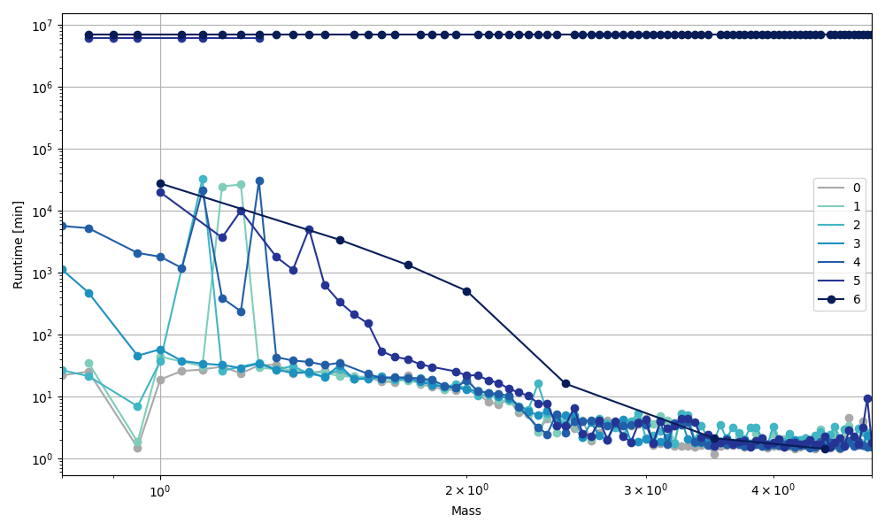

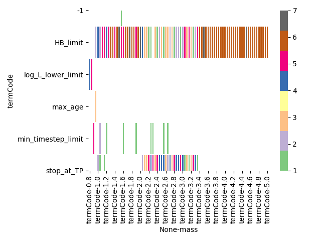


## Models that did not complete He burning
<!-- fs -->
True problem models do not complete He burning and max_age<10Gyr

```python
# Final center He4 values
def plot_he4end(rcdf):
    pvt = {'index':'mass','columns':'cb','values':'center_he4_end'}
    args = {'logy':True,'marker':'o','color':[cbcmap(cb) for cb in range(7)]}
    plt.figure(figsize=figsize)
    rcdf.reset_index().pivot(**pvt).plot(**args)
    plt.axhline(1e-6,c='k',lw=1) # _part_ of MIST EEP TP-AGB
    plt.axhline(1e-4,c='k',lw=1) # MIST EEP terminal age core He burning (TACHeB)
    plt.ylabel('center_he4 (final)')
plot_he4end(rcdf)
plt.savefig('plots/he4end_all.png')

# Models with final center_he4 > 1e-4
rhe4 = rcdf.loc[rcdf.center_he4_end>1e-4,:]
hhe4 = hdf.loc[rhe4.index,:]
# plot_HR(hhe4, color='dt', title='final He4 > 1e-4', save='plots/HR_he4_all.png')
# Get rid of models with max age > 10Gyr (all < 1Msun), they are not a problem
max_age = hhe4.star_age.groupby(level=['cb','mass']).max()
rhe4 = rhe4.loc[max_age<1e10,:] # max age < 10 Gyr
# Get rid of models currently running
rhe4 = rhe4.loc[~rhe4.index.isin(idx_currently_running),:]
# There are 3 models with final center_he4 ~ 1e-4...
# Deciding these are ok and getting rid of them
rhe4 = rhe4.loc[rhe4.center_he4_end>1e-3,:]
hhe4 = hhe4.loc[rhe4.index,:]

# Plot the true problem models
plot_HR(hhe4, color='dt', title='final He4 > 1e-3', save='plots/HR_he4_probmods.png')
plot_he4end(rhe4)
plt.savefig('plots/he4end_probmods.png')

# for those that don't, how close are they?
# plot HR with color by dt
# find number of years it took model of same mass, previous cb to get from where this star is to He<10^-6
```

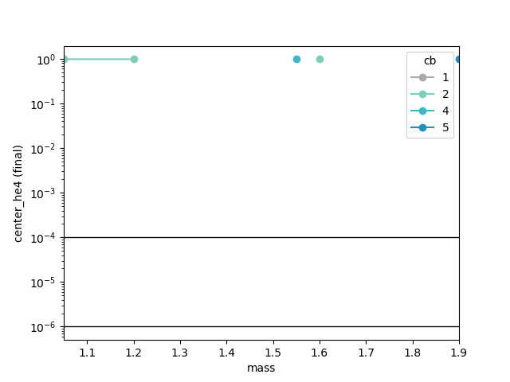

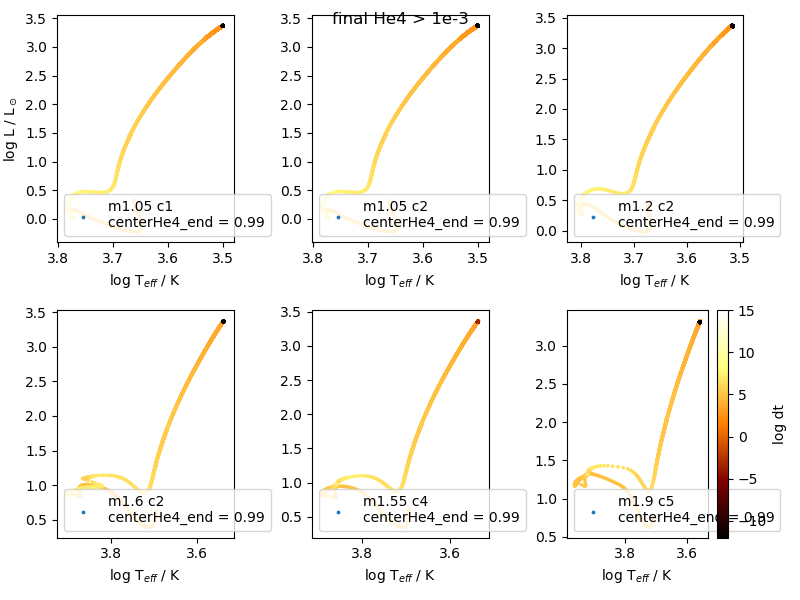

__There are 5 models that did not get close to completing core He burning: m1p05c1, m1p60c2, m1p55c4__

__Possible Options:__

- [x]  set max age
- [ ]  rerun with smaller min_timestep_limit
- [ ]  are there any He burning settings I can try?


<!-- fe ## Models that did not complete He burning -->


## Check post-MS DM effects
<!-- fs -->
Check the following in post-MS models:
- [ ]  Core: DM should not affect the core
- [ ]  H burning shell

Focusing on problem model m1p60c2 since there are both higher and lower cboosts at this mass the terminated normally.

```python
mass = 1.60
cboosts = [0,1,2,3,4] # these are done for m=1.60
priorities = [94,93,92] # TAMS and He ignition

pipms = pidf.loc[idx[:,mass],:]
# hpms = hdf.loc[pipms.index,:]

ppms = load_profiles(pipms,[mass],cboosts,priorities,max_mod=True)
# Plot extra_heat
plot_profiles_all(ppms)
plt.savefig(f'plots/xheat_m{mass}.png')

# ppms50 = load_profiles(pipms,[mass],[2],[50])
# plt.figure()
# plot_profiles(ppms50,plt.gca())
# plt.savefig('tp/xheat50.png')
```

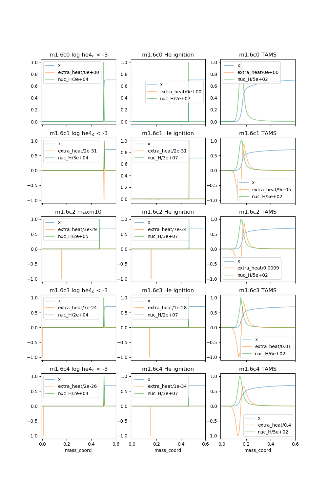

These all seem fine. Not sure why there is a spike in xheat in post-TAMS models, but its magnitude is so small that it should not be a problem.

<!-- fe ## Check that DM affects after the MS -->

<!-- fe # Investigate Possible problem models -->


# Sand
<!-- fs -->

## Check runtimes
<!-- fs -->
```python
hdf, pi_df, c_df, rcdf = load_all_data(dr=dr, get_history=False)
plot_runtimes(rcdf, save='runtimes_Feb11.png')
```

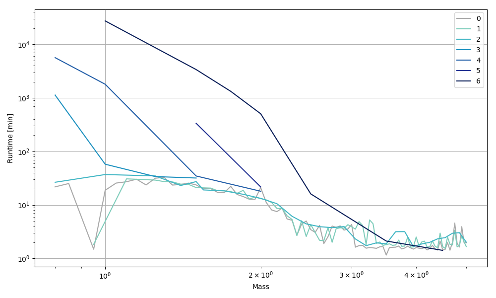

__Currently running models:__
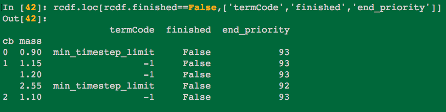

I think the three with `termCode = -1` are stuck in very small timesteps. Should check again in a few days and cancel them if they're still running.
<!-- fe ## Check runtimes -->

## Investigate models stuck in small timesteps
<!-- fs -->
Need to reduc history file sizes so can load reasonably.
This takes too long on Roy.
I could not install python3 on Osiris, check_for_reduc will not run with python2.
I could not log into Osiris from Korriban (don't have password).
Doing this manually in bash:

On Osiris:
```bash
cd DMS/mesaruns/bash_scripts/
./data_reduc.sh /home/tjr63/DMS/mesaruns/RUNS_defDM/c1/m1p15/LOGS
./data_reduc.sh /home/tjr63/DMS/mesaruns/RUNS_defDM/c1/m1p20/LOGS
./data_reduc.sh /home/tjr63/DMS/mesaruns/RUNS_defDM/c2/m1p10/LOGS
```

__Load data and see what's done:__
Doing this on Osiris in `mesaruns_analysis` dir.

<!-- ```bash
echo $DISPLAY
screen
export DISPLAY=:11.0
``` -->
```python
%run fncs

## LOAD DATA
hdf, pidf, cdf, rcdf = load_all_data(dr=drO, get_history=True, use_reduc=False)

## RUNTIMES
rcdf.loc[rcdf.runtime<0,'runtime'] # check for negative runtimes
rcdf = fix_negative_runtimes(rcdf)
plot_runtimes(rcdf, save='plots/runtimes_Mar6.png')
```

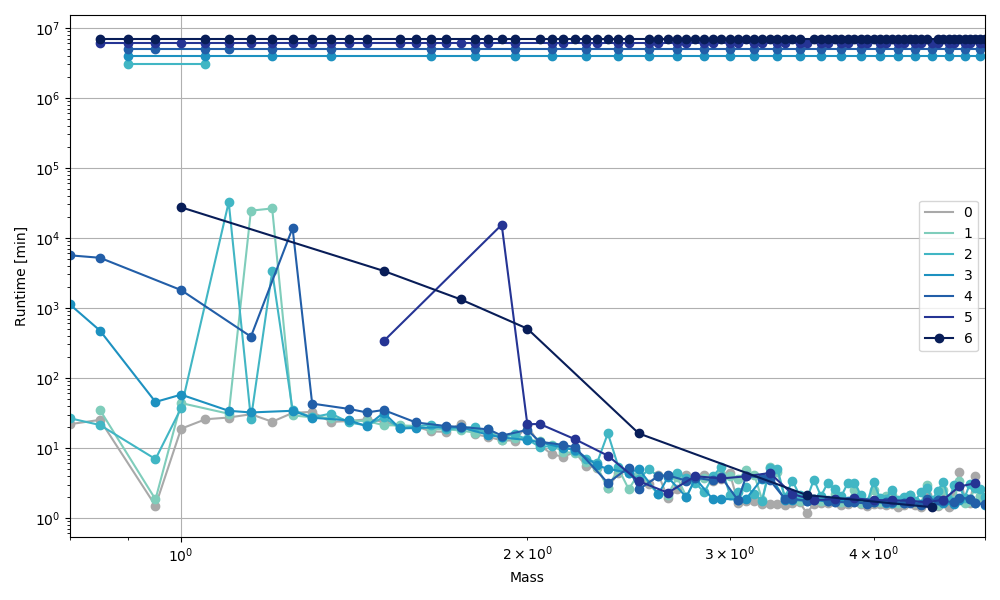


```python
## Num models in MS
MSmods = h.groupby(level=['cb','mass']).apply(MSmodels) # df of enter, leave
MSmods['numinMS'] = MSmods.leave - MSmods.enter
pvt = {'index':'mass','columns':'cb','values':'numinMS'}
args = {'logy':True,'marker':'o','color':[cbcmap(cb) for cb in range(7)]}
MSmods.reset_index().pivot(**pvt).plot(**args)
plt.ylabel('# Models in MS')
plt.savefig('plots/numinMS.png')

## Ratio of numinMS/final model_number
MSmods['inMS_final'] = MSmods.numinMS/MSmods.final
pvt['values'] = 'inMS_final'
MSmods.reset_index().pivot(**pvt).plot(**args)
plt.gca().xaxis.set_minor_locator(AutoMinorLocator())
plt.grid(True,which='both')
plt.ylabel('# models in MS / # models Total')
plt.savefig('plots/inMS_final.png')
```

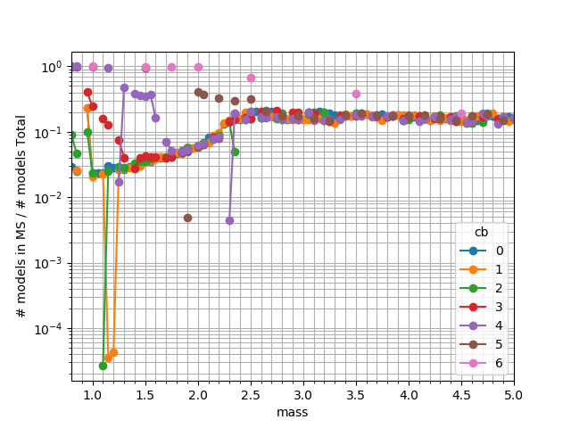

<!-- fe ## Investigate models stuck in small timesteps -->


## "Problem" models
<!-- fs -->
```python
# models where either:
#   runtime > 1e4
#   inMS_final < 1e-4
#   termCode == 'min_timestep_limit'
probidx =   list(rcdf.loc[rcdf.runtime>1e4,:].index) + \
            list(rcdf.loc[rcdf.termCode=='min_timestep_limit',:].index) + \
            list(MSmods.loc[MSmods.inMS_final<1e-4,:].index)
probidx.sort()
hprob = h.loc[probidx,:]
plot_HR(hprob, color='dt', title='problem models', save='plots/probmods_HR.png')
```

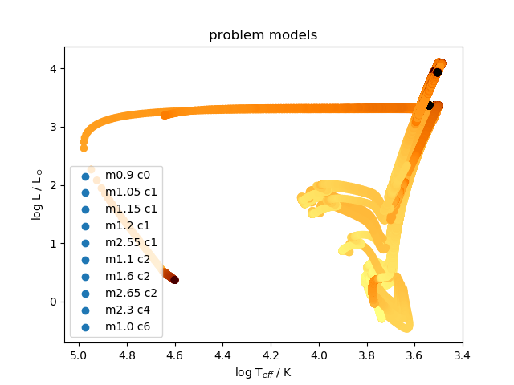


```python
# histograms of log_dt for problem models
hdfm.hist(by=['cb','mass'], column='log_dt', bins=25)
plt.savefig('plots/probmods_logdt_hist.png')
plt.show(block=False)

# Get STD errors and reduce dt codes for problem models
mods = []
for (c,m) in probidx:
    mstr = mass_encode(m,'str')
    # f'm{int(m)}p{int((m%1)*10)}'
    # if len(mstr) == 4: mstr = f'{mstr}0'
    mods.append(f'{mstr}c{c}')
reddtdf, probTxdf = load_dt_root_errors(dr=drO, mods=mods)

# bar charts of reduce dt codes
# plt.figure(figsize=(6,10))
# pvt = {'index':'code','columns':('cb','mass'),'aggfunc':{'code':len},'fill_value':0}
# reddtdf.pivot_table(**pvt).plot.bar(subplots=True,rot=45,ax=plt.gca(),sharex=True)
# plt.tight_layout()
# plt.savefig('plots/probmods_reddt_codes.png')

# heatmap of reduce dt codes
plt.figure()
pvt = {'index':'code','columns':('cb','mass'),'aggfunc':{'code':len},'fill_value':0}
sns.heatmap(reddtdf.pivot_table(**pvt),cmap='YlGnBu',linewidths=.5)#,annot=True)
plt.tight_layout()
plt.savefig('plots/probmods_reddt_codes_heat.png')

# title = 'models that quit due to min_timestep_limit', color='dt'
# plot_HR(mtlhdf, color='dt', title=title, save='plots/probmods_HR.png')

```

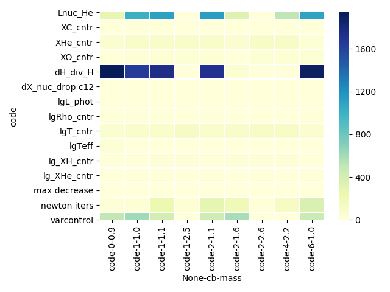

<!-- fe ## "Problem" models -->


__Models that stopped early due to `min_timestep_limit`__
```python
# Models that quit early due to `min_timestep_limit`
mintlim = rcdf.loc[rcdf.termCode=='min_timestep_limit',:]
mods = ['m0p90c0','m2p55c1','m1p60c2','m2p65c2']
mtlhdf, __, __, __ = load_all_data(dr=dr, get_history=True, mods=mods)
# mtlh = hdf.loc[mintlim.index,:]
title = 'models that quit due to min_timestep_limit', color='dt'
plot_HR(mtlhdf, color='dt', title=title, save='HR_mintlim.png')

#
# plt.figure(figsize=(6,10))
# # ax = plt.gca()
# cols = ['end_priority','log_dt_min','center_h1_end','center_he4_end']
# mintlim.plot(y=cols,kind='bar',subplots=True)
# plt.xticks(rotation=45)
# plt.tight_layout()
# plt.show(block=False)
#
#
# notdone = rcdf.loc[rcdf.finished==False,:]
# ndh = hdf.loc[notdone.index,:]
#
# slow = rcdf.loc[rcdf.log_dt_min<-5,:]
# slh = hdf.loc[slow.index,:]
# plot_log_dt(slh)
#
# ndsl = hdf.loc[notdone.index.intersection(slow.index),:] # not done + low min timestep
#
current = rcdf.loc[rcdf.termCode==-1,:]
crh = hdf.loc[current.index,:]
title = 'currently running models 2/21/20'
plot_HR(crh, title=title, save='HR_current_022120.png')
current[cols]
#
# plot_HR(ndsl, save=None)


rcdf.log_max_rel_energy_error.sort_values()
```

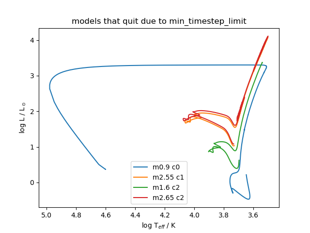
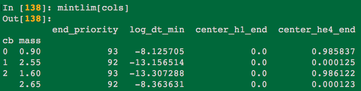

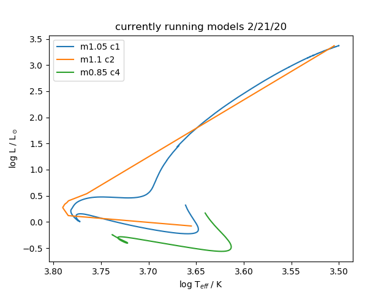
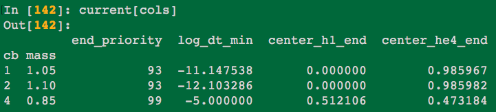
Note m1p1c2 model HR looks funny because using history_reduc.data.

STD.out warnings (reduce dt and Tx set to Tcenter)
```python
mods = ['m0p90c0','m2p55c1','m1p60c2','m2p65c2', # mintlim
        'm1p05c1','m1p10c2','m0p85c4'] # current
reddtdf, probTxdf = load_dt_root_errors(dr=dr, mods=mods)
plot_reddt(reddtdf, title=None, save=None)

hdf, pi_df, c_df, rcdf = load_all_data(dr=dr, get_history=True, mods=mods)
```

<!-- fe ## Sand -->
