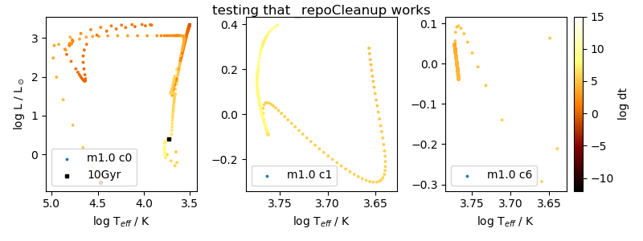

# Cleanup repo for use by others
3/31/2020

Travis Hurst's student, Logan, is trying to use my code and having problems getting it running. Looking at the repo, I'm sure it's very confusing to anyone but me, so I'm cleaning it up. Will delete unnecessary files, create simple inlists for the `master` branch, and move all files that others don't need to use (e.g. bash scripts to run bulk jobs with my parameters) into a different branch.

Immediately prior (during, and after) to this I was doing my final runs from the `defDM` branch. If I've lost important changes after this, they can probably be recovered from that branch.

## Changes to `master` branch
- [x]  Merge `defDM` branch changes (mostly for the upgrade to MESA-r12115) into `master`
- [x]  rename 'wimp' -> 'DM'
- [x]  delete paper and abstract submodules
- [x]  create new branch `master-tjraen` from `master` (with above changes completed)
- [x]  strip down `run_star_extras.f`
- [x]  history and profile lists -> current MESA-r12115 default files
- [x]  `inlist_master` -> `inlist` and strip down
- [x]  `inlist_options_tmplt` -> `inlist_DM` and put all DM stuff here
    - [x]  add options to set DM mass and xsection in this inlist
- [x]  update main `readme.md`
- [x]  delete unnecessary files and directories
- [x]  clean up `DM_module.f`
- [x]  check that `master` branch works by running (in `sand` dir)
    - [x]  1 Msun, c0 (stopped manually after a couple of days, see below)
    - [x]  1 Msun, c6

Remove lines from `sand/LOGS/STD.out` for readability:
```python
bad_words = [' is_slope_negative returns false. ', ' retry ', 'save photos/x']
with open('LOGS/STD.out') as oldfile, open('LOGS/STDclean.out', 'w') as newfile:
    for line in oldfile:
        if not any(bad_word in line for bad_word in bad_words):
            newfile.write(line)
```

Check on models
```bash
mv LOGS LOGS_c0
cp inlist inlist_DM LOGS_c0/.
mv photos LOGS_c0/.
mv STDclean.out STD.out LOGS_c0/.
```
```python
# run this from within the _defDM dir to use its fncs.py
%run fncs
hpath = [   '/home/tjr63/sand/LOGS_c0/history.data',
            '/home/tjr63/sand/LOGS_c6/history.data',
            '/home/tjr63/sand/RUNS_master-tjraen/c1/1p0/LOGS/history.data']
hdflst = []
for hp, cb in zip(hpath, [0,6,1]):
    hdf = pd.read_csv(hp, header=4, sep='\s+')
    hdf['cb'], hdf['mass'] = cb, 1.0
    print(hdf.cb.unique())
    hdflst.append(hdf.set_index(['cb','mass']))
hdf = pd.concat(hdflst, axis=0)

title = 'testing that _repoCleanup works'
figpath = '/home/tjr63/sand/HR.png'
plot_HR(hdf, color='dt', title=title, save=figpath)
```

__c0 model__ is taking a very long time to finish, but I think it's running fine (4/1/20). It finished the MS by model 350. First time lg_dt_yr goes negative is after H_cntr=0.

Now (4/3/20) stopping c0 model to test c6 model. Inlist stop run was only set to logL < -1 so that it would run to WD. Model has been stuck in small timesteps at logL ~= -0.73 for a long time. I think it is running sufficiently well for my purposes. Others can tweak inlist settings to get this to a WD if they want.

__c6 model__ is going along fine. No need to finish the run; stopping early.



__c1 model__ is from `master-tjraen` branch (see below).


- [x]  check `RUNS_defDM` `STD.out` files for `WRITE` output from `DM_module.f` indicating that a suitable root for Tx could not be found. Look through files indicated in `prob.mods` to make sure the "problem model" timesteps were retried by MESA.

```bash
cd DMS/mesaruns/RUNS_defDM
find . -type f -print | xargs grep "problem model " &>> prob.mods
```


## Pull in changes to `master-tjraen` (later renamed to `Raen2020`)
- [x]  history and profile lists from `defDM` (don't know why these didn't get copied over when I merged `defDM` to `master`)
- [x]  pull in code cleanup changes that I made to `master`
- [x]  check that I can run MESA from this branch

```bash
mv LOGS LOGS_c6
git checkout master-tjraen
./clean
./mk
screen
cd bash_scripts
maindir="/home/tjr63/sand"
RUNS="RUNS_master-tjraen"
cb=1
mass=1p0
mval=1.0
source ${maindir}/bash_scripts/do_mesa_run.sh
do_mesa_run "${maindir}" "${RUNS}/c${cb}/${mass}" "${mval}" "${cb}" 0 "master" 1 0 &> STD.out
```

This ran successfully through to core H exhaustion in 358 models :thumbsup:. See HR plot above.


## Brett's feedback
- [x]  shorten repo intro (top line) to ~10 words
- [x]  don't bold first part of readme
- [x]  add a license, see [Marvin's](https://github.com/sdss/marvin/blob/master/LICENSE.md)
- [ ]  add a changelog, see [Marvin's](https://github.com/sdss/marvin/blob/master/CHANGELOG.rst)
- [x]  name `master-tjraen` branch after the paper, `Raen2020`

```bash
git checkout master-tjraen
git branch -m Raen2020
git push origin --delete master-tjraen
git push origin -u Raen2020
```
