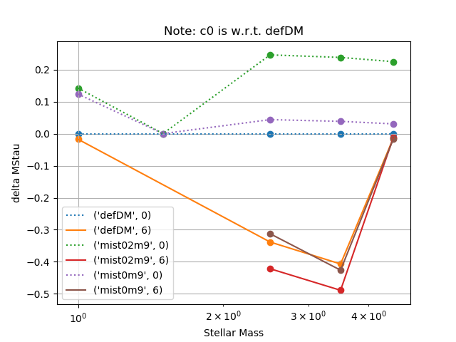
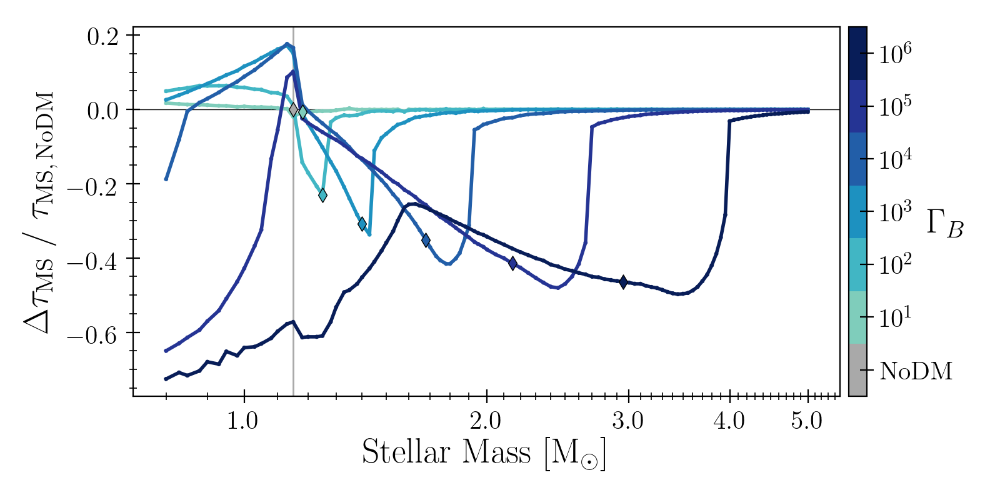
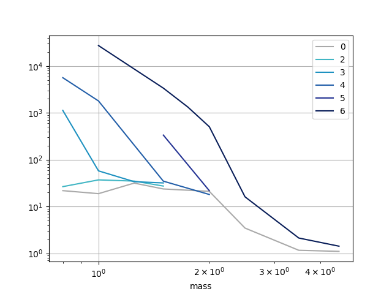
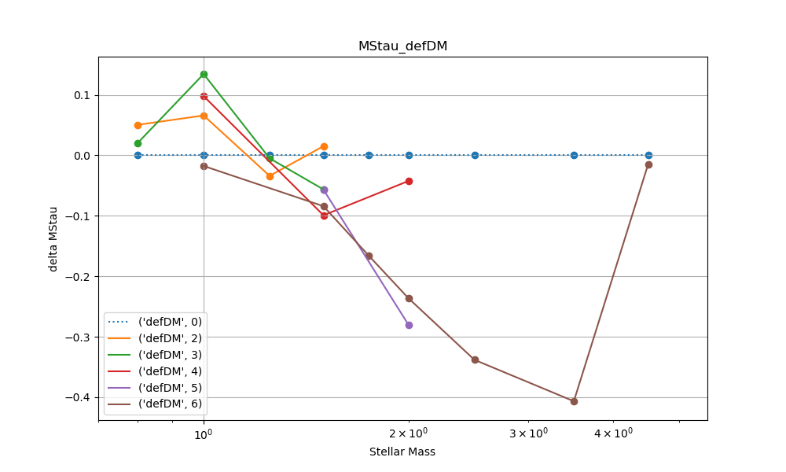

- [new Main Runs after resolving largeLH problem/branch](#firstruns)
- [Cleanup/fix inlist and run_star_extras to better match MIST](#fixMIST)
    - [Baseline run using MESA m1p0 inlist plus settings needed for DM](#defDM)
    - [Run with full MIST options](#fullMISTmf)
    - [Separate MIST options](#MISToptions)
- [Comparing Runs](#compareRuns)
- [Run more defDM models](#more_defDM)
- [Sand](#sand)

# Questions
<!-- fs -->

- [x]  __Which settings to use and which masses to re-run?__
    -  Checked a MESA defaults + DM set, a set with the full MIST settings (minus extra files because I could not get MESA to compile when they were included -- MIST was written for an older version of MESA), and several sets with partial MIST settings. Many/most MIST runs failed for one or more c0 models.
    -  In __higher mass range__ (convective cores), delta_MStau results are qualitatively similar to my original results. Need to check that energy was sufficiently conserved for these models, then just __use original results__. Differences likely smaller than existing uncertainties due to stellar physics and settings.
    -  In __lower mass range__ (radiative cores), __delta_MStau ~ 0__ (__`defDM` settings__, MS lifetimes very similar to no DM models. See `defDM` MStau plots [here](#more_defDM)). Stellar structures seem fine. __Run sparse mass grid to find the mass at which results start to diverge from original results. Don't run fine mass grid; skip isochrones.__
        -  Combining MIST with new version of MESA (sec [fixMIST](#fixMIST)) was difficult. None of my tests ([full](#fullMISTmf) and [separating options](#MISToptions)) successfully completed the c0 models. Would need to change too many things to do a fair comparison with MIST paper, so might as well just use `defDM` settings.
    - [ ]  _What to do about intermediate region where results are different and deltaTau != 0?_ ___I think I need to rerun all models except very lowest (e.g. < m1p0). Otherwise I think I'll have to drop all data < ~m1p6___

- [ ]  Try to reduce run time (see plot below)
    - [x]  using lower number of threads seems to help. See branch `runtimeTests`.
    - [ ]  possibly alter mesh, see options [here](https://lists.mesastar.org/pipermail/mesa-users/2011-September/000526.html)
    - [-]  Michael suggests writing my own differential equations solver (look into stiff equations). See Ch 8, 9 of Computational Physics book. He thinks the addition of DM is causing the equations to be different enough that what MESA does no longer works well.
        - not doing this... I had not explained very well all the different inlist (and rse) combinations I was testing and which were having problems (`MIST` runs not finishing c0 runs but `defDM` did). Have decided (in consult with Andrew) to just use `defDM`.


## Questions/things to consider from Michael and Brett:
- [ ]  Why is delta_MStau higher for m1p0c3 than for m1p0c6? (e.g. maybe related to CNO)
- [ ]  Check total energy output over MS lifetimes, is it interesting?
- [ ]  Normally, Tau_MS /propto M_star^-3... why does increasing DM by factor of 10 move plot feature by ~1 Msun? Also, why is that feature so sharp (i.e. why does effect drop off so quickly as mass increases)?

<!-- fe Questions -->

-----------------------------------------------------------------------------
<a name="firstruns"></a>
# new Main Runs after resolving largeLH problem/branch
<!-- fs  -->
LOGS in dir `RUNS_3test_final`.
On Osiris node3, using same inlist as before with the following added:
```
# inlist:
use_dedt_form_of_energy_eqn = .true. # very first runs had this commented out but m4p5c0 failed
use_gold_tolerances = .true.
# Runs dir from run_osiris#.sh:
RUNS="RUNS_3test_final"
```

```bash
./clean
./mk

nohup nice ./bash_scripts/run_osiris1.sh &>> STD1_nohup.out &
nohup nice ./bash_scripts/run_osiris2.sh &>> STD2_nohup.out &
```

__m4p5c0 (and several others) still did not finish.__ Terminate with errors (see STD.out in LOGS dir):.
```
stopping because of problems dt < min_timestep_limit
terminated evolution: cannot find acceptable model
termination code: min_timestep_limit
```
__Check MIST inlist stuff.__

<!-- fe # new Main Runs after resolving largeLH problem/branch -->


-----------------------------------------------------------------------------
<a name="fixMIST"></a>
# Cleanup/fix inlist and run_star_extras to better match MIST
<!-- fs -->

<!-- fs defDM -->
### <a name="defDM">__run key: \_defDM__</a>

Starting with newest default files for `MESA-r12115`, `test_suite/1M_pre_ms_to_wd`:
`inlist_to_end_agb` (using some necessary settings from `inlist_start`) and `src/run_star_extras.f`.

- [x]  Rename the `inlist_master` and `src/run_star_extras.f` (append `_ow_12172019`) files I have been using for easy reference to previous settings.
- [x]  Copy newest MESA default files over.
- [x]  Update defaults to match my needs for added DMS stuff and my preferences fo non-physics settings (e.g., saving history columns, profiles, etc.)
- [x]  Test these settings (before incorporating MIST) to establish a baseline and see if c0 models will finish. Using file versions `inlist_master_default_plus_DM` and `run_star_extras_default_plus_DM`:

```bash
./clean
./mk

nohup nice ./bash_scripts/run_osiris1.sh &>> STD1_nohup.out &
```

__These models ran fine. I let m1p0c6 run all the way through, took 19 days__

```bash
# do data_reduc on m1p0c6, keeping only every model_number%1000==0 during MS
cd bash_scripts
nano data_reduc.sh # then change $mcol % 5 -> $mcol % 1000 (2 places)
./data_reduc.sh /home/tjr63/DMS/mesaruns/RUNS_runSettings/c6/m1p0_defDM
```

<!-- fe defDM -->

<!-- fs fullMISTmf -->
### <a name="fullMISTmf">__run key: \_fullMISTmf (mf: minus files, does not include MIST `MESA_files/mesa_source` files)__</a>

- [x]  Update to MIST settings (see Table 1 of MIST1 paper (Choi16) and dir `MIST_MESA_files`)
    - [x]  Update both files (everything except high mass stars (>10Msun) options)
        - [x]  Wind schemes have changed in new MESA version. See [controls defaults](http://mesa.sourceforge.net/controls_defaults.html) under `cool_wind_AGB_scheme` for info/instructions. Amounts to changing `Reimers_wind_eta -> Reimers_scaling_factor` and `Blocker_wind_eta -> Blocker_scaling_factor` in both files.
    - [-]  Replace MESA files with those in MIST_MESA_files/mesa_source and do clean, mk, export (see MIST_MESA_files/README)
        - [ ]  In `mesa-r12115/atm/private/e2_pairs.dek` line 460 change `E2_NPAIRS` -> `NPAIRS` _not working because multiple files call this one_
        - [-]  In `mesa-r12115/atm/public/atm_def.f90` add line 143: `integer, parameter :: E2_NPAIRS = npairs`
        - [-]  In `mesa-r12115/atm/private/table_atm.f90` fix 2 `Warning: Nonconforming tab character`
        <!-- - Check: `mesa-r12115/atm/private/table_atm.f90`, line 344 `which_atm_option == atm_photosphere_tables` -->
        - [-]  Copy/paste `subroutine table_atm_shutdown()` from `table_atm_OG.f90` to `table_atm.f90`
            - [-]  Comment out line 194 `call free_table_summary(ai_db_wd_25)`
        - dir `atm` still not compiling, moving on...
        - dir `const` compiled fine
        - doing `./mk` in `mesa-r12115/star` gives `No rule to make target 'opacities.mod', needed by 'star_lib.o'`
        - __Unable to get these files into compatibility with mesa-r12115. Trying without these files.__ Most have to do with `atm` (boundary conditions), will just use MESA photosphere table option. `mesa_49.net` adds some isos and reactions that I don't _think_ will be important.


```bash
./clean
./mk

nohup nice ./bash_scripts/run_osiris1.sh &>> STD1_nohup_MIST.out &
```

__These models are not running well. C0 models taking a _very_ long time and m2p5c0 quit early due to `dt < min_timestep_limit`.__ I stopped them after ~24 hours (and m1p0c0 still hadn't finished).

__Next, start with the most basic/simple MIST inlist and run_star_extras options and then add options one at a time.__
<!-- fe fullMISTmf -->

<!-- fs seperate mist options -->
### <a name="MISToptions">__Separate MIST options__</a>
The following runs will have run keys coded with `\_mist#` where `#` in:

0.  Basic options: run_star_extras_default_plus_DM and inlist_master_default_plus_DM + solar abundances, eos, opacity, jina reaction rates, radiation turbulence, mass loss (AGB, RGB scaling factors). _run_key = _basicMIST == _mist0_
    -  `0w`: everything in 0 plus winds section, also add `other_wind` to `run_star_extras`.
1.  mesh and timestep params: varcontrol_target and mesh_delta_coeff options
2.  convection, mlt, semiconvection, thermohaline, and overshoot
3.  rotation
4.  mesa_49.net
5.  atm_option ~~+ winds~~
6.  diffusion
7.  `m7`: opacity (subtract from basic)
8.  `m8`: radiation turbulence (subtract from basic)
9.  `m9`: mass loss (subtract from basic)
Did not do postAGB burning (run_star_extras)

`\_mist0 = \_basicMIST` m1p5c0 would not finish, `log_dt_yr` down to -11 after MS. Tried subtracting 7, 8, 9 from 0. Only `m9` would finish m1p5c0. Adding winds controls to inlist and run_star_extras (`0w`) and testing... This did not work (m1p5c0 does not finish). Now start with `m9` and add 1-6 one at a time.

`\_mist01m9` ran overnight. m1p5c0 finished but m1p0c0 did not.

`\_mist02m9` had some c0 models that didn't finish, quit with dt < limit.

Trying 0m9 again to make sure it's running right... looks fine. Checked that mist0#m9 files (inlist and rse) match mist0m9. Continuing tests.

`\_mist03m9` c0 didn't finish.

`_mist04m9/` m1p5c0 didn't finish.

`_mist05m9/` m1p5c0 didn't finish.

`_mist06m9/` m1p0c0 didn't finish.

`_mist07m9/` I stopped it at m1p5c6... no such inlist file. this run had `inlist_master_mist06m9` and `run_star_extras_default_plus_DM.f`

```bash
nohup nice ./bash_scripts/run_osirisMIST.sh "_mist07m9" &>> STD1_nohup_MIST.out &
```

<!-- fe seperate mist options -->

<!-- fe # Cleanup/fix inlist and run_star_extras to better match MIST -->


-----------------------------------------------------------------------------
<a name="compareRuns"></a>
# Compare runs
<!-- fs -->
Would like to use `mist02m9` if possible (includes convection which is important to my results), but m1p0c0 and m1p5c0 terminate early due to `dt < min_timestep_limit`. Most dt reductions of these two runs were due to `reduce dt because of Lnuc_He` which refers to the control `delta_lgL_He_limit`, but this has the same setting for all runs (see `cdf.DELTA_LGL_HE_LIMIT.unique()`).

```python
%run fncs
rk = ['defDM','mist0m9','mist02m9']
hdf, pidf, cdf, rcdf = load_all_data(dr=dr, run_key=rk, get_history=True, use_reduc=True)

# Look at differences in settings using controls#.data files:
# c = control_diff(cdf.sort_index().loc[idx[['mist0m9','mist02m9'],0,1.0,:],:])
# c.drop(['INITIAL_MASS','X_CTRL','USE_OTHER_ENERGY_IMPLICIT'],inplace=True,axis=1)
c = control_diff(cdf.sort_index().loc[idx[:,0,1.0,'max_mod'],:])

# delta MStau
rc = rcdf.copy()
rc = calc_delta_MStau(rc, c0_ref_key='defDM') # for c0, calculate w.r.t. defDM
rc.delta_MStau.replace(-1.0,np.nan) # get rid of runs that did not finish
rc.loc[rc.delta_MStau.round(1)==-1.0,'delta_MStau'] = np.nan
plot_delta_MStau(rc, save='MStau.png', title='Note: c0 is w.r.t. defDM')

# c6 runtimes
dd6 = rcdf.loc[idx['defDM',6,:],:].copy()
dd6.loc[idx['defDM',6,1.0],'runtime'] = 19*24*60 # this is a negative number in STD.out
dd6.reset_index('mass').plot('mass','runtime',loglog=True,grid=True,kind='scatter')
plt.xlim(0.7,5.0)
plt.ylim(0.9,1e6)
plt.title('c6, defDM runtime (minutes)')
plt.savefig('runtime.png')
plt.show(block=False)

# all runtimes
rc = rcdf.copy()
rc.loc[idx['defDM',6,1.0],'runtime'] = 19*24*60 # this is a negative number in STD.out
plt.figure()
ax = plt.gca()
for cb, df in rc.reset_index('mass').groupby(level='cb'):
    clr = cbcmap(cb)
    df.plot('mass','runtime',loglog=True,grid=True,ax=ax,label=cb,c=clr)
plt.savefig('runtimeAll.png')
plt.show(block=False)


# compare defDM m1p0 c0->c6
# profiles
dirs = [ pjoin(dr,f'c{cb}','m1p0_defDM/LOGS') for cb in [0,6] ]
pdf, pidf = load_profiles(dirs)

plot_profile(pdf, 'temperature', qlim=0.95)
qlim = 1.0
plot_profile(pdf, 'logRho', qlim=qlim)
plot_profile(pdf, 'logP', qlim=qlim)
plot_profile(pdf, 'logL', qlim=qlim)
plot_profile(pdf, 'x', qlim=qlim)
plot_profile(pdf, 'y', qlim=qlim)
plot_profile(pdf, 'mixing_type', qlim=qlim) # c0 has rotational mixing, c6 does not
plot_profile(pdf, 'np', qlim=qlim) # runs with use_dedt_form_of_energy_eqn=True do not write out np properly... this is meaningless
qlim=0.5
plot_profile(pdf, 'pp', qlim=qlim)
plot_profile(pdf, 'cno', qlim=qlim)

# history
h1 = hdf.loc[idx['defDM',0:6,1.0],:]
cols = ['mass_conv_core',
        'pp',
        'cno',
        'log_Teff',
        'log_center_T',
        # 'wimp_temp', # plotted with log_center_P
        'log_center_Rho',
        'log_center_P',
        'he_core_mass',
        'center_h1',
        'center_degeneracy',
        'rel_error_in_energy_conservation',
]
plot_history(h1.loc[((h1.star_age>1e7)&(h1.star_age<9e9)),:],cols[0:5])
plot_history(h1.loc[((h1.star_age>1e8)&(h1.star_age<7e9)),:],cols[5:])
# luminosity
ac, lums = 0, ['age','L','LH','Lgrav','extra_L']
lum_dict = {0: lums_dict(hdf.loc[idx['defDM',0,1.0],:], lums, age_cut=ac),
            6: lums_dict(hdf.loc[idx['defDM',6,1.0],:], lums, age_cut=ac)}
plot_lums_history_06(lum_dict)

```
__MStau:__



Compare to original runs:


__Runtimes:__




__Compare defDM m1p0 c0 -> c6__

These all look as expected.

<!-- fe Compare Runs -->


-----------------------------------------------------------------------------
# <a name="more_defDM">__Run more defDM models__</a>
<!-- fs -->
```bash
nohup nice ./bash_scripts/run_osirisMIST1.sh "_default_plus_DM" &>> STD_nohup_MIST1.out &
nohup nice ./bash_scripts/run_osirisMIST2.sh "_default_plus_DM" &>> STD_nohup_MIST2.out &
nohup nice ./bash_scripts/run_osirisMIST3.sh "_default_plus_DM" &>> STD_nohup_MIST3.out &

# Later: run m0p8c5:6 with 8 threads each
nohup nice ./bash_scripts/run_osirisMIST5.sh "_default_plus_DM" &>> STD_nohup_MIST5.out &
nohup nice ./bash_scripts/run_osirisMIST6.sh "_default_plus_DM" &>> STD_nohup_MIST6.out &
```

_On Osiris: reduce large file sizes:_
```python
import osiris_fileReduc as ofr
ofr.check_for_reduc(dr=ofr.dr, run_key=['defDM'], max_fsize=500.0)
```

_On Roy, look at data:_
```python
rk = ['defDM']
hdf, pidf, cdf, rcdf = load_all_data(dr=dr, run_key=rk, get_history=True, use_reduc=True)

# delta MStau
rc = rcdf.copy()
rc = calc_delta_MStau(rc, c0_ref_key='defDM') # for c0, calculate w.r.t. defDM
# rc.loc[rc.delta_MStau.round(1)==-1.0,'delta_MStau'] = np.nan # remove unfinished runs
plot_delta_MStau(rc, save='MStau_defDM.png', title='MStau_defDM')

```

__MStau:__



Compare to original runs:


___Copy defDM runs to new dir in prep for filling in mass grid for final runs.___
```bash
maindir="/home/tjr63/DMS/mesaruns"
cd ${maindir}
fromd="RUNS_runSettings"
tod="RUNS_defDM"

for c in $(seq 0 6); do
    todir="${tod}/c${c}"
    mkdir ${todir}
    for dir in $(ls -d ${fromd}/c${c}/*_defDM/); do
        cp -r ${dir} ${todir}/.
    done
done
```
<!-- fe -->


-----------------------------------------------------------------------------
# <a name="sand">__Sand__</a>
<!-- fs -->
Everything below here is unorganized.. keeping it in case need to reproduce some tests.

```python
h8 = hdf.loc[idx[:,:,0.8],:]
h8 = h8.loc[h8.star_age>1e7,:]
plt.figure()
ax = plt.gca()
h8.groupby(level='cb').plot('log_Teff','log_L',ax=ax,logx=False, rever)
plt.show(block=False)

# ALL
rk = ['defDM','mist0m9','mist01m9','mist02m9','mist03m9','mist04m9','mist05m9'
        ,'mist06m9','mist07m9']
hdfa, pidfa, cdfa, rcdfa = load_all_data(dr=dr, run_key=rk, get_history=False)

# pd.options.display.max_columns = len(rcdf.columns)

################
%run fncs
rk = ['defDM','mist0m9','mist01m9','mist02m9','mist03m9','mist04m9','mist05m9'
        ,'mist06m9','mist07m9']
hdf, pidf, rcdf = load_all_data(dr=dr, run_key=rk, get_history=False)

rk = ['defDM','mist0m9','mist02m9','mist06m9','mist07m9']
hdf, pidf, rcdf = load_all_data(dr=dr, run_key=rk, get_history=True)
# pd.options.display.max_columns = len(rcdf.columns)
# this one hasn't finished yet so can't change dir name directly:
# rcdf.drop(index=('',6,1.0), inplace=True)
plot_pidf(pidf, save=None)
plot_rcdf_finished(rcdf, save=None)
cols = ['runtime', 'steps', 'log_dt_min', 'end_priority', ]
plot_rcdf(rcdf, save=None, cols=cols)
cols = ['runtime', 'retries', 'backups', 'steps', 'log_dt_min']
plot_rcdf(rcdf, save=None, cols=cols)
cols = ['log_max_rel_energy_error', 'log_cum_rel_energy_error']
plot_rcdf(rcdf, save=None, cols=cols)
cols = ['end_priority', 'center_h1_end', 'center_he4_end',]
plot_rcdf(rcdf, save=None, cols=cols)

# look at different slices
h = hdf.loc[(),:]
hunfin = hdf.loc[hdf.finished==False,:]
# punfin = pidf.loc[pidf.finished==False,:]
runfin = rcdf.loc[rcdf.finished==False,:]
# idx = pd.IndexSlice
r2 = rcdf.loc[idx['mist02m9',0:6,0:5],:]
h2 = hdf.loc[idx['mist02m9',0:6,0:5],:]

plot_rcdf_finished(rcdf, save=None)
cols = ['runtime', 'steps', 'log_dt_min', 'end_priority', 'termCode', ]
plot_rcdf(r2, save=None, cols=cols)
cols = ['center_h1_end','center_he4_end']
plot_rcdf(r2, save=None, cols=cols)
r2.plot('star_age','log_dt', logx=True)

# with controls files
dir = os.path.join(dr,'c6','m2p5_defDM')
cpath = os.path.join(dir,'LOGS/controls1.data')
cs = load_controls(cpath)


############
rk = ['test']
hdf0, pidf0, cdf0, rcdf0 = load_all_data(dr=dr, run_key=rk, get_history=True)

cdf = pd.concat([cdf,cdf0])
drop_cols = ['TRACE_HISTORY_VALUE_NAME', 'STAR_HISTORY_DBL_FORMAT',
             'STAR_HISTORY_INT_FORMAT', 'STAR_HISTORY_TXT_FORMAT',
             'PROFILE_INT_FORMAT', 'PROFILE_TXT_FORMAT', 'PROFILE_DBL_FORMAT',
             'FORMAT_FOR_FGONG_DATA', 'FORMAT_FOR_OSC_DATA'
            ]
parse_cols = ['MESH_LOGX_MIN_FOR_EXTRA', 'MESH_DLOGX_DLOGP_EXTRA',
              'MESH_DLOGX_DLOGP_FULL_ON', 'MESH_DLOGX_DLOGP_FULL_OFF',
              'XA_FUNCTION_SPECIES', 'XA_FUNCTION_WEIGHT', 'XA_FUNCTION_PARAM',
              'DIFFUSION_CLASS_REPRESENTATIVE', 'DIFFUSION_CLASS_A_MAX'
              ]
c = cdf.copy()
for col in c.columns:
    c[col] = c[col].apply(lambda x: ','.join(x) if type(x)==list else x)
    # print(col)
    unq = len(c[col].unique())
    if unq!=1:
        print(unq)
        print()

def tlist(itm):
    if type(itm)==list:
        itm = ','.join(itm)

for col in c.columns:
    if col in drop_cols: continue
    if col in parse_cols:
        c[col] = c[col].apply(lambda x: ','.join(x))
        # print('joined')
    print(col)
    unq = len(c[col].unique())
    if unq!=1:
        print(col)
        print(unq)
        print()

for col in c.columns:
    if col in drop_cols: continue
    if col in parse_cols:
        c[col] = c[col].apply(lambda x: ','.join(x))
        print('joined')
        print(col)
        print(len(c[col].unique()))
        print()
```


## To do next:
- [ ]  Check:
    - [ ]  do all runs finish?
    - [ ]  are nx, np negative?
    - [ ]  Compare:
            - runtimes, # models, # backups, # retries, # total newton iters, avg dt/step, min dt
            - MStau, Tc, Rhoc, wimp_temp, Teff(hottest), L(end of MS),
    - [ ]  m2p5c6 "root must be bracketed"

- [ ]  Try with:
    - [ ]  default energy scheme

<!-- fe sand -->
