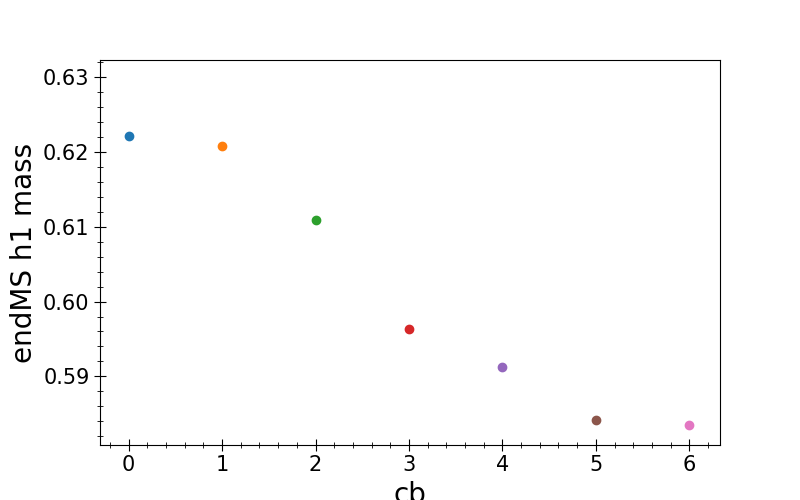
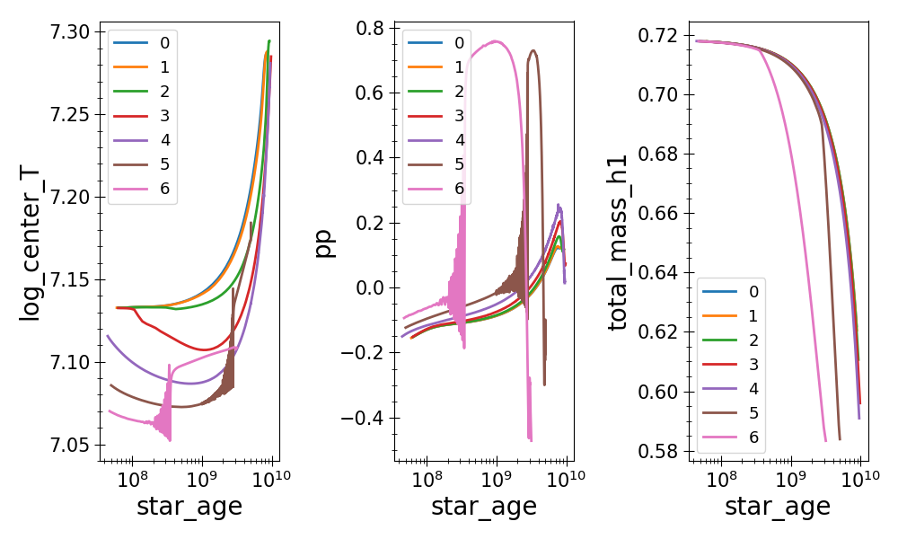

# Increased MS lifetimes
<!-- fs -->
Why do MS lifetimes of solar mass stars with cb in {1,2,3,4} have increased liftimes?
Check:  averages of central temp, central burning rate (use pp luminosity as proxy)
        fraction of h1 left at end of MS

Results:
These stars:
    * have decreased central temps
    * have increased burning
    * rate of burning in shell near r_DM is increased (see profile plots in DMS paper). This gives them access to more fuel
    * burn more total hydrogen over their lifetimes

This is a competition between increased burning rate (decreasing lifetimes) and increased burning extent due to increased temps in a shell giving it access to more fuel (increasing lifetimes)

```python
import plot_fncs as pf
import pandas as pd
from matplotlib import pyplot as plt

# load 1.0 Msun history data
mass = 1.0
fromf = pf.get_r2tf_LOGS_dirs(masses=[mass], cbs=[cb for cb in range(7)])
hlst = []
mslst = []
for cb in range(7):
    h = pf.get_hdf(cb,mass=mass, from_file=fromf[pf.get_hidx(cb,mass)])
    h['cb'] = cb
    hlst.append(h)

    ms = pf.cut_HR_hdf(h,cuts=['ZAMS_time_step','H-3'])
    mslst.append(ms)

hdfs = pd.concat(hlst, axis=0)
msdfs = pd.concat(mslst, axis=0)

hdfs.columns
['model_number', 'star_age', 'star_mass', 'log_dt', 'num_zones',
       'mass_conv_core', 'he_core_mass', 'c_core_mass', 'o_core_mass',
       'si_core_mass', 'fe_core_mass', 'log_LH', 'log_LHe', 'log_LZ',
       'log_Lnuc', 'extra_L', 'log_extra_L', 'log_Lneu', 'log_Teff', 'log_L',
       'log_R', 'log_g', 'log_center_T', 'log_center_Rho', 'log_center_P',
       'center_degeneracy', 'center_gamma', 'center_mu', 'center_ye',
       'center_abar', 'center_h1', 'center_he4', 'center_c12', 'center_c13',
       'surface_h1', 'total_mass_h1', 'total_mass_he4', 'pp', 'cno',
       'tri_alfa', 'trace_mass_location', 'trace_mass_radius', 'log_max_T',
       'max_T_mass', 'max_T_radius', 'delta_nu', 'delta_Pg', 'acoustic_radius',
       'total_internal_energy_start', 'total_energy_start',
       'total_internal_energy', 'total_energy', 'total_extra_heating',
       'total_energy_sources_and_sinks', 'num_retries', 'num_backups',
       'num_newton_iterations', 'wimp_temp', 'Nx_total', 'center_nx',
       'center_np', 'Tx_emoment', 'extra_energy', 'xL/Lnuc', 'cb', 'hidx']

# plot T and pp over time
fig, axs = plt.subplots(nrows=1, ncols=3, sharex=True, figsize=(10,6))
for cb, df in msdfs.groupby('cb'):
    for l, ylbl in enumerate(['log_center_T', 'pp', 'total_mass_h1']):
        df.plot('star_age', ylbl, label=cb, ax=axs[l])
        axs[l].set_ylabel(ylbl)
plt.semilogx()
plt.tight_layout()
plt.savefig('m1.0.png')
plt.show(block=False)

# plot total_mass_h1
plt.figure()
for cb, df in msdfs.groupby('cb'):
    plt.scatter(cb, df.iloc[-1].total_mass_h1/df.iloc[-1].star_mass)
plt.xlabel('cb')
plt.ylabel('endMS h1 mass')
plt.savefig('m1.0_totalh1.png')
plt.show(block=False)

# # hacking:
# mslst = []
# meanlst = []
# for h in hlst:
#    ms = pf.cut_HR_hdf(h,cuts=['ZAMS_time_step','H-3'])
#    mslst.append(ms)
#
#    elapsed_time = ms.time_step.sum()
#    meanT = (ms.log_center_T* ms.time_step).sum() / elapsed_time
#    meanpp = (ms.pp* ms.time_step).sum() / elapsed_time
#    meancno = (ms.cno* ms.time_step).sum() / elapsed_time
#    meanlst.append(pd.Series({'log_center_T':meanT, 'pp':meanpp, \
#                    'cno':meancno, 'cb':ms.cb.unique()[0]}))
# msdfs = pd.concat(mslst, axis=0)
# means = pd.concat(meanlst,axis=1).T
#
# # means['T'] = (means['log_center_T']-means.loc[0,'log_center_T'])/means.loc[0,'log_center_T']
# # means['p'] = (means['pp']-means.loc[0,'pp'])/means.loc[0,'pp']
# fig, axs = plt.subplots(nrows=1, ncols=3)
# means.plot('cb','log_center_T', ax=axs[0])
# means.plot('cb','pp', ax=axs[1])
# means.plot('cb','cno', ax=axs[2])
# plt.show(block=False)
#
# # checking that CNO < PP. passed.
# plt.figure()
# ax = plt.gca()
# means.plot('cb','cno', ax=ax)
# means.plot('cb','pp', ax=ax)
# plt.show(block=False)
#
# mage = msdfs.set_index('star_age')
# mage.groupby('cb')['pp'].plot()
#
#
# hg.plot('star_age','pp', legend=True, ax=ax)
```



<!-- fe # Increased MS lifetimes -->
