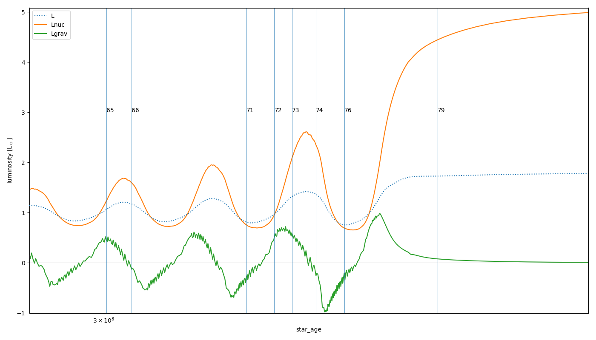
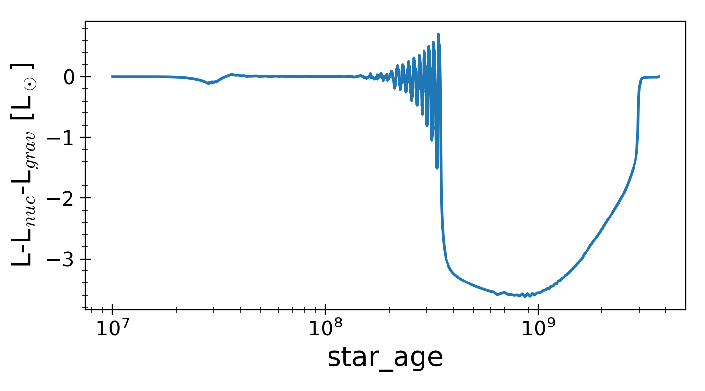
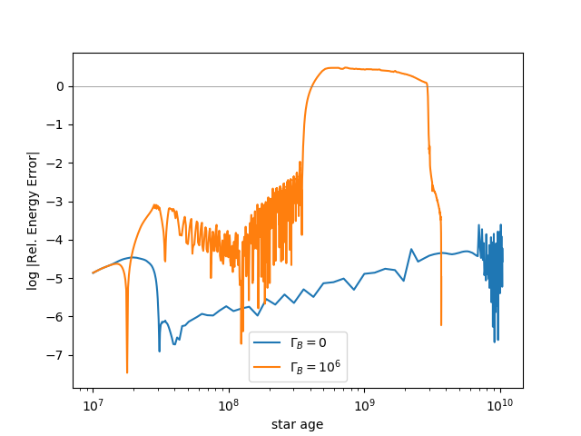
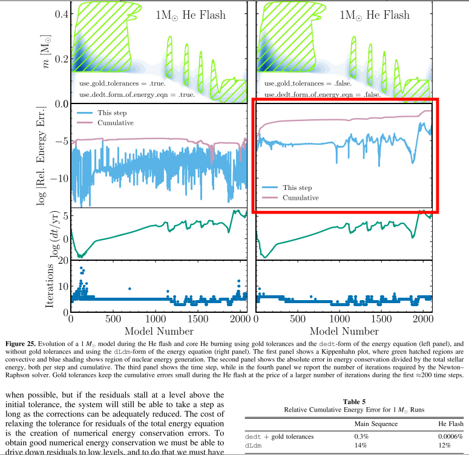

<!-- data generated using `./bash_scripts/run_osiris.sh` -->

```python
%run largeLH_data_fncs
hdf, pidf, h0df, pi0df = load_main_data()
```

# Results from older MESA version (r10398)
<!-- fs -->
## which timesteps have profiles? (and plot lum v age)
<!-- fs  -->
```python
lums = ['age','L','Lnuc','Lgrav','Ltneu']
dic = lums_dict(hdf, lums)

plot_lums_history(dic, profiles='all')

# profile numbers to load to df
# pidf.loc[((pidf.star_age>3e8) & (pidf.star_age<4e8)),:]
pnums4df = [65,66,71,72,73,74,76,79] #***--- NEEDED TO PLOT LUMINOSITY PROFILES ---***#
plot_lums_history(dic, profiles=pnums4df, hdf=hdf)
```



<!-- fe which timesteps have profiles? -->


## plot luminosities v age
<!-- fs  -->
```python
lums = ['age','L','Lneu','Lnuc','Lgrav']
dic = lums_dict(hdf, lums)
plot_lums_history(dic)
```
<!-- fe plot luminosities v age -->


## plot luminosity profiles
<!-- fs  -->
```python
# load profiles to df
# get pnums4df from 'which timesteps have profiles?' section
pdf = load_profiles_df(pnums4df)
# plot
d = plot_lums_profiles(pdf, hdf=hdf)
```

<!-- fe plot luminosity profiles -->

## plot temperatures
<!-- fs  -->
```python
plot_T_profiles(pdf)
```
<!-- fe plot temperatures -->


## check conservation of energy
<!-- fs  -->
```python
hdf_dict = {'0': h0df.loc[h0df.star_age>1e7,:], '10^6': hdf.loc[hdf.star_age>1e7,:]}
plot_lum_excess(hdf_dict)
plot_energy_cons_error(hdf_dict, title='') # compare to Paxton19_Fig25.png
```



Compare the Rel. Energy Error plot with Paxton19 Fig 25:



__The problem seems to be that energy is simply not conserved sufficiently well.
Need to install latest MESA version (which includes an update that significantly
improves energy conservation) and run these again.__

<!-- fe check conservation of energy -->

<!-- fe # Results from older MESA version (r10398) -->


# Results from newest MESA version (r12115)
