- [Original Problem](#op)
- [Results from MESA r10398](#r10398)
- [Results from MESA r12115](#r12115)
    - [_dedt_gold](#dedtgold)
    - [_defaults](#defaults)
    - [_gold_false](#goldfalse)


# Questions

- [x]  Why is L < LH?
    - Likely not conserving energy well enough. Runs using the new gold tolerances do not show this problem. Problem is reproduced in new MESA version with gold tolerances turned off, see [_gold_false](#goldfalse).
    - See MESA paper 5 (Paxton19) for a description of gold tolerances

- [ ]  Why are nx, np < 0 in run \_dedt_gold?

- [ ]  Why is eps_grav == 0 in run \_dedt_gold?

- [ ]  Which energy scheme should I use?

- [ ]  Given that MS lifetimes results are different and the runs are taking a lot longer, need to decide how many models to re-run.


-----------------------------------------------------------------------------
<!-- data below was generated using `./bash_scripts/run_osiris.sh` -->
```python
%run largeLH_data_fncs
hdf, pidf, h0df, pi0df = load_main_data()
```
-----------------------------------------------------------------------------

<a name="op"></a>
# Original Problem
<!-- fs -->
__This branch is used to investigate why L < LH in the m1p0c6 model, as seen here:__
```python
# hog_path = mesaruns + '/RUNS_2test_final/c6/m1p00/LOGS/history.data'
hog_path = mesaruns + '/RUNS_2test_final/plotsdata/mass1p00/LOGSc6/history.data'
hogdf = pd.read_csv(hog_path, header=4, sep='\s+').set_index('model_number', drop=False)
lums = ['age', 'L','LH','Lnuc','extra_L']
dicog = lums_dict(hogdf.loc[hogdf.star_age<3e9,:], lums)
plot_lums_history(dicog, title='Original Run: m1p0c6')

dicog = lums_dict(hogdf.loc[hogdf.star_age>3e9,:], lums)
plot_lums_history(dicog, title='Original Run: m1p0c6')
lums = ['age', 'L','LH','extra_L'] # exclude Lnuc to see what the others do
dicog = lums_dict(hogdf.loc[hogdf.star_age>3e9,:], lums)
plot_lums_history(dicog, title='Original Run: m1p0c6')
```


In the process of making the above plot I realized that the luminosity goes completely crazy at the very end of the run.

 
<!-- fe og problem -->
-----------------------------------------------------------------------------


<a name="r10398"></a>
# Results from older MESA version (r10398)
<!-- fs -->
This is a closer investigation of the original problem:

```python
path_dict = {'dr': dr_r10398, 'run_key': ''}
hdf, pidf, h0df, pi0df = load_main_data(**path_dict)
```
#### which timesteps have profiles? (and plot lum v age)
<!-- fs  -->
```python
lums = ['age','L','Lnuc','Lgrav','Ltneu']
dic = lums_dict(hdf, lums)

plot_lums_history(dic, profiles='all')

# profile numbers to load to df
# pidf.loc[((pidf.star_age>3e8) & (pidf.star_age<4e8)),:]
pnums4df = [65,66,71,72,73,74,76,79] #***--- NEEDED TO PLOT LUMINOSITY PROFILES ---***#
plot_lums_history(dic, profiles=pnums4df, hdf=hdf)
```


<!-- fe which timesteps have profiles? -->

#### plot luminosity profiles
<!-- fs  -->
```python
pdf = load_profiles_df(pnums4df, **path_dict)
d = plot_lums_profiles(pdf, hdf=hdf)
```

<!-- fe plot luminosity profiles -->

#### plot temperatures
<!-- fs  -->
```python
plot_T_profiles(pdf)
plot_Tx_minus_T_profiles(pdf)
```
<!-- fe plot temperatures -->


#### check conservation of energy
<!-- fs  -->
```python
hdf_dict = {'0': h0df.loc[h0df.star_age>1e7,:], '10^6': hdf.loc[hdf.star_age>1e7,:]}
plot_lum_excess(hdf_dict)
plot_energy_cons_error(hdf_dict, title='') # compare to Paxton19_Fig25.png
```


Compare the Rel. Energy Error plot with Paxton19 Fig 25:


__The problem seems to be that energy is simply not conserved sufficiently well.
Need to install latest MESA version (which includes an update that significantly
improves energy conservation) and run these again.__

<!-- fe check conservation of energy -->

<!-- fe # Results from older MESA version (r10398) -->
-----------------------------------------------------------------------------

<a name="r12115"></a>
# Results from newest MESA version (r12115)
<!-- fs -->

<!-- fs run_key: _dedt_gold -->
<a name="dedtgold">__run key: \_dedt_gold__</a>

This run uses inlist options:
```
use_dedt_form_of_energy_eqn = .true.
use_gold_tolerances = .true.
!which_atm_option = 'simple_photosphere' (uses default, 'simple_photosphere' does not work in this version of MESA)
```
I stopped the c6 run early to try other settings. It ran for about 60 hours.
Now restarting the model (Friday 12/13 ~2pm) on __Osiris wnode3__ to let it finish:
```bash
cd DMS/mesaruns/RUNS_largeLH_mesa-r12115/c6/m1p0_dedt_gold
# copy re file from mesaruns and alter path to star file
# revert history_columns.list and profile_columns.list to version from 7 days ago
# (get from github) and update inlist to read them
nohup nice ./re x250 &>> LOGS/STD.out &
```
MESASDK has been updated since this run was started, but I don't think that should make any difference.

```python
sd = 'plots_r12115/dedt_gold/' # dir to save plots
path_dict = {'dr': dr_r12115, 'run_key': '_dedt_gold'}
hdf, pidf, h0df, pi0df = load_main_data(**path_dict)
```

#### which timesteps have profiles? (and plot lum v age)
<!-- fs  -->
```python
lums = ['age','L','Lnuc','Lgrav','Ltneu']
lums = ['age', 'L','LH','Lnuc','Lneu','Lgrav','Ltneu','extra_L']
dic = lums_dict(hdf, lums)
plot_lums_history(dic, profiles='all', hdf=hdf)

# profile numbers to load to df
# pidf.loc[((pidf.star_age>3e8) & (pidf.star_age<4e8)),:]
pnums4df = [8,10,2,1] #***--- NEEDED TO PLOT LUMINOSITY PROFILES ---***#
plot_lums_history(dic, profiles=pnums4df, hdf=hdf, title='c6')

p0nums4df = [30,32,34,36,41] #***--- NEEDED TO PLOT LUMINOSITY PROFILES ---***#
dic0 = lums_dict(h0df, lums)
plot_lums_history(dic0, profiles=p0nums4df, hdf=h0df, title='c0')

```
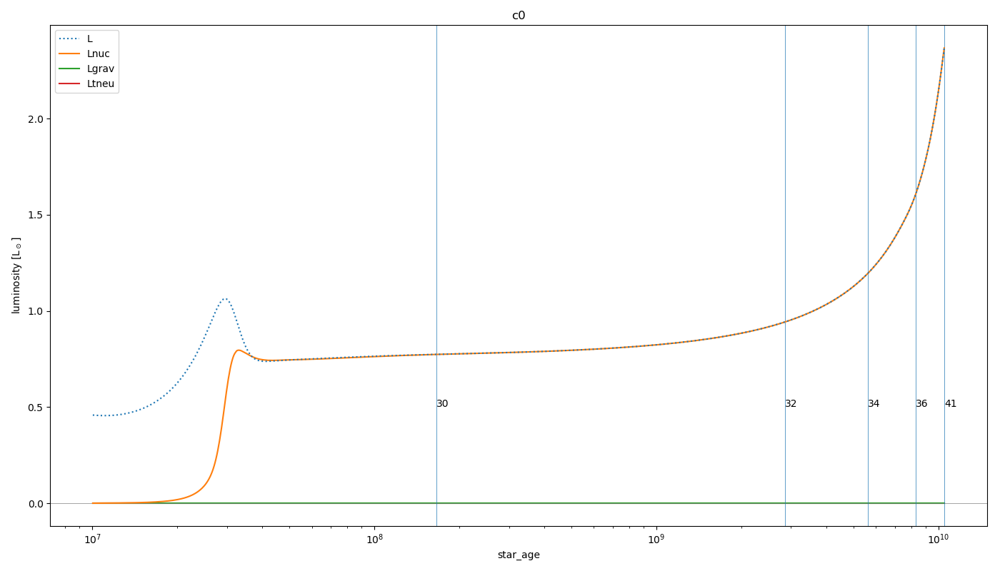
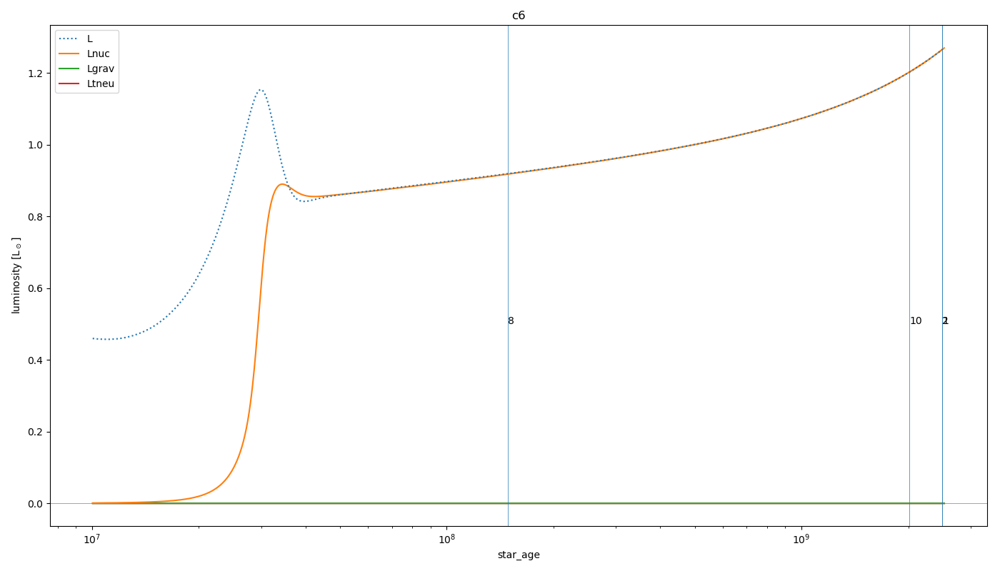

__Note Lgrav is now 0 throughout.__ Not sure what has changed in calculating Lgrav in this version of MESA. This uses history column `eps_grav_integral`. There is also a column `total_eps_grav` that I haven't saved here, but will save and check in future runs.

<!-- fe which timesteps have profiles? -->

#### plot luminosities v age
<!-- fs  -->
```python
# plot both c0, c6 together
lums = ['age','L','Lnuc','Lgrav']
dic6 = lums_dict(hdf, lums)
dic0 = lums_dict(h0df, lums)
dic = {'0': dic0, '10^6': dic6}
plot_lums_history_06(dic, save=sd+'lum_v_age.png')

```

<!-- fe plot luminosities v age -->

#### plot luminosity profiles
<!-- fs  -->
```python
pdf = load_profiles_df(pnums4df, cb=6, **path_dict)
d = plot_lums_profiles(pdf, hdf=hdf, title='c6')
p0df = load_profiles_df(p0nums4df, cb=0, **path_dict)
d0 = plot_lums_profiles(p0df, hdf=h0df, title='c0')
```
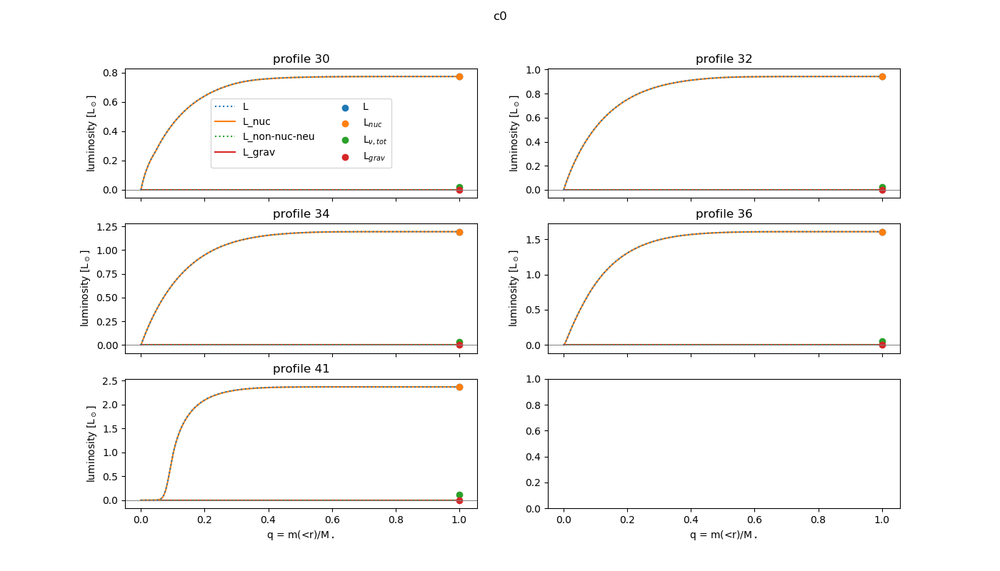
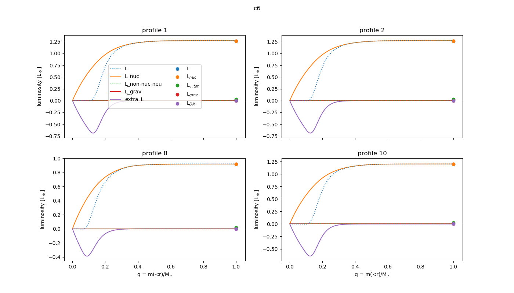

<!-- fe plot luminosity profiles -->

#### check conservation of energy
<!-- fs  -->
```python
hdf_dict = {'0': h0df.loc[h0df.star_age>1e7,:], '10^6': hdf.loc[hdf.star_age>1e7,:]}
plot_lum_excess(hdf_dict, save=sd+'Lexcess.png')
plot_energy_cons_error(hdf_dict, save=sd+'rel_enery_error.png') # compare to Paxton19_Fig25.png
```

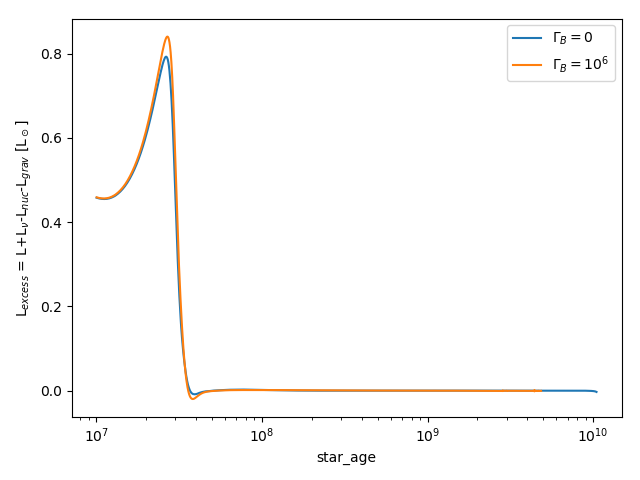 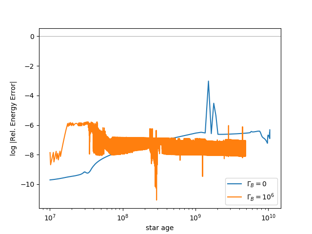

__Physical energy does not seem to be conserved during pre-ZAMS since Lgrav is 0 (see above). Relative energy error is now acceptably low.__ (Compare to Paxton19_Fig25 above. I believe the relative energy error is _numerical_ energy error. This uses history column `error_in_energy_conservation`, see [this mailing list question](https://lists.mesastar.org/pipermail/mesa-users/2015-November/005921.html) and equation 57 in MESA paper 3 (Paxton 2015))

<!-- fe check conservation of energy -->

#### plot other history columns
<!-- fs  -->
```python
hdf_dict = {'0': h0df.loc[((h0df.star_age>1e7)&(h0df.star_age<3e9)),:], '10^6': hdf.loc[hdf.star_age>1e7,:]}
plot_burning_06(hdf_dict)
plot_center_abundances(hdf_dict, title='center H1', save=sd+'center_h1.png')
```
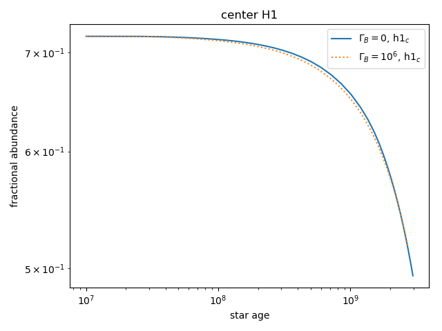
<!-- fe #### plot other history columns -->

#### plot other profiles
<!-- fs  -->
```python
# pnums4df = [8,14]
# p0nums4df = [30,32]
# pdf = load_profiles_df(pnums4df, cb=6, **path_dict)
# p0df = load_profiles_df(p0nums4df, cb=0, **path_dict)
plot_Tx_minus_T_profiles(pdf)
plot_convection(pdf)
plot_T_profiles(pdf, title='c6')
plot_T_profiles(p0df, title='c0')
plot_eps_profiles(pdf, title='c6')
plot_eps_profiles(p0df, title='c0')
plot_abundance_profiles(pdf, title='c6')
plot_abundance_profiles(p0df, title='c0')
plot_nx_profiles(pdf, title='c6')
plot_rho_profiles(pdf, title='c6')
```

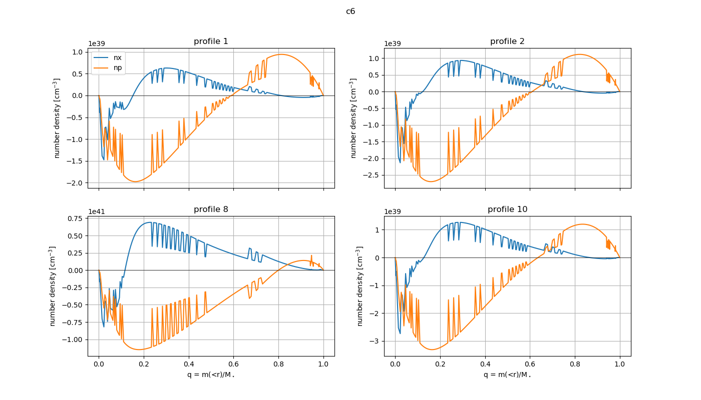

__nx and np are negative... this doesn't make any sense.__ These are values I am calculating. I have looked at my code and I don't understand how this is happening. nx is a normalization factor (common to every cell) multiplied by an exponential, and should therefore always be positive (or at least all cells should be either positive or negative together). np is the hydrogen mass fraction times the density divided by the mass of a proton, and should therefore always be positive.

<!-- fe plot other profiles -->
<!-- fe run: _dedt_gold -->

------------------------------------------------------------------------------
<!-- fs run_key: _defaults -->
<a name="defaults">__run key: \_defaults__</a>

This run uses the __new MESASDK__ and __default inlist options__:
```
!use_dedt_form_of_energy_eqn = .true. (should use Eq 65 in Paper 4, Paxton18)
!use_gold_tolerances = .true. (still uses gold tolerances since this is default)
!which_atm_option = 'simple_photosphere' (uses default, 'simple_photosphere' does not work in this version of MESA)
```
I stopped the c6 run early to try other settings. It ran for about 24 hours.

```python
sd = 'plots_r12115/defaults/' # dir to save plots
path_dict = {'dr': dr_r12115, 'run_key': '_defaults'}
hdf, pidf, h0df, pi0df = load_main_data(**path_dict)
```

#### which timesteps have profiles? (and plot lum v age)
<!-- fs  -->
```python
lums = ['age','L','Lnuc','Lgrav','Ltneu']
lums = ['age', 'L','LH','Lnuc','Lneu','Lgrav','Ltneu','extra_L']
dic = lums_dict(hdf, lums)
plot_lums_history(dic, profiles='all', hdf=hdf)

pnums4df = [15,8,14,9]
s = sd+'lum_v_age_c6_with_profile_nums.png'
plot_lums_history(dic, profiles=pnums4df, hdf=hdf, title='c6', save=s)

p0nums4df = [9,10,11,13]
dic0 = lums_dict(h0df, lums)
s = sd+'lum_v_age_c0_with_profile_nums.png'
plot_lums_history(dic0, profiles=p0nums4df, hdf=h0df, title='c0', save=s)
```
Physical energy seems to be conserved as Lgrav is no longer zero.
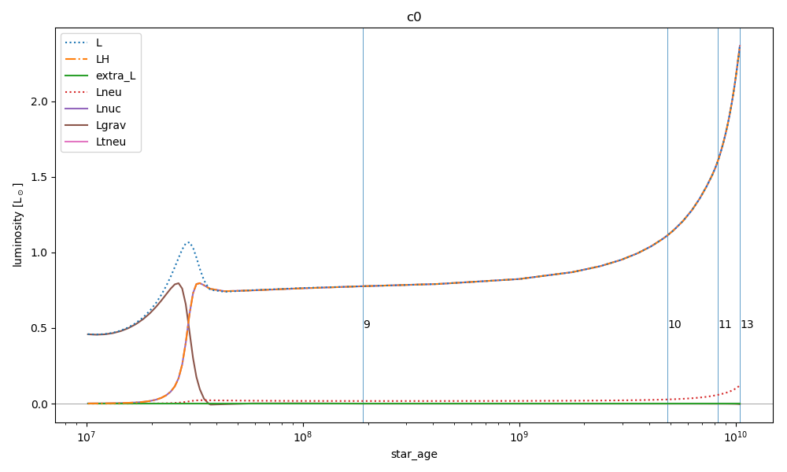
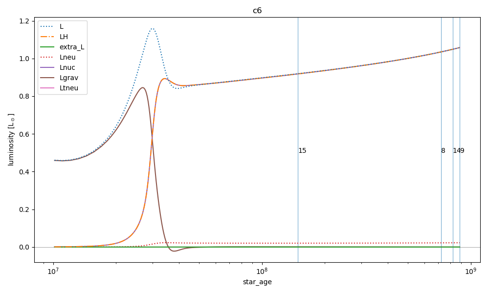
<!-- fe #### which timesteps have profiles? (and plot lum v age) -->

#### plot luminosities v age
<!-- fs  -->
```python
# plot both c0, c6 together
lums = ['age','L','Lnuc','Lgrav']
dic6 = lums_dict(hdf, lums)
dic0 = lums_dict(h0df, lums)
dic = {'0': dic0, '10^6': dic6}
plot_lums_history_06(dic)

```
<!-- fe plot luminosities v age -->

#### plot luminosity profiles
<!-- fs  -->
```python
# load profiles to df
# get pnums4df from 'which timesteps have profiles?' section
pdf = load_profiles_df(pnums4df, cb=6, **path_dict)
d = plot_lums_profiles(pdf, hdf=hdf, title='c6')

p0df = load_profiles_df(p0nums4df, cb=0, **path_dict)
d0 = plot_lums_profiles(p0df, hdf=h0df, title='c0')
```
<!-- fe #### plot luminosity profiles -->

#### check conservation of energy
<!-- fs  -->
```python
hdf_dict = {'0': h0df.loc[h0df.star_age>1e7,:], '10^6': hdf.loc[hdf.star_age>1e7,:]}
plot_lum_excess(hdf_dict, save=sd+'Lexcess.png')
plot_energy_cons_error(hdf_dict, title='', save=sd+'rel_energy_error.png') # compare to Paxton19_Fig25.png
```
Only problem so far is with c0 run. STD.out file contains several of these: `WARNING: rel_run_E_err`. I think gold tolerances are being relaxed automatically.

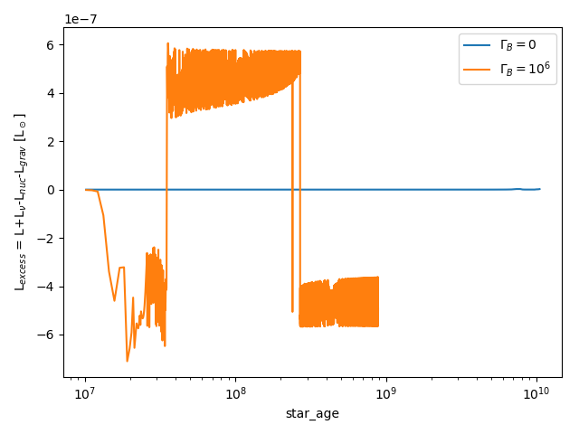 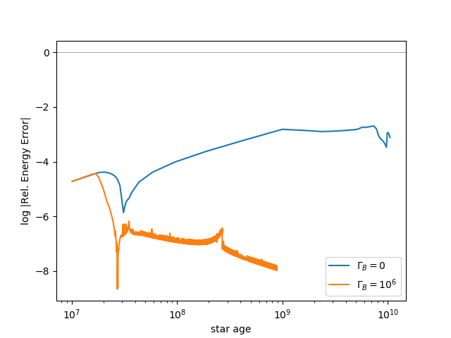

<!-- fe check conservation of energy -->

#### plot other profiles
<!-- fs -->
```python
plot_nx_profiles(pdf, title='c6', log=False)
plot_nx_profiles(pdf, title='c6', log=True, save=sd+'nx_np_profiles.png')
plot_Tx_minus_T_profiles(pdf)
plot_convection(pdf)
plot_T_profiles(pdf, title='c6')
plot_T_profiles(p0df, title='c0')
plot_eps_profiles(pdf, title='c6')
plot_eps_profiles(p0df, title='c0')
plot_abundance_profiles(pdf, title='c6')
plot_abundance_profiles(p0df, title='c0')
plot_rho_profiles(pdf, title='c6')

```
nx and np look normal again.

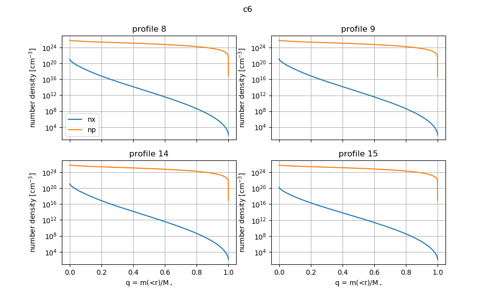
<!-- fe plot other profiles -->

<!-- fe run: _defaults -->

------------------------------------------------------------------------------
<!-- fs run_key: _gold_false -->
<a name="goldfalse">__run key: \_gold\_false__</a>

This run uses the __new MESASDK__ and __default energy equation and gold tolerances turned off__:
```
!use_dedt_form_of_energy_eqn = .true. (should use Eq 65 in Paper 4, Paxton18)
use_gold_tolerances = .false.
!which_atm_option = 'simple_photosphere' (uses default, 'simple_photosphere' does not work in this version of MESA)
```

```python
sd = 'plots_r12115/gold_false/' # dir to save plots
path_dict = {'dr': dr_r12115, 'run_key': '_gold_false'}
hdf, pidf, h0df, pi0df = load_main_data(**path_dict)
```

#### plot luminosities v age
<!-- fs  -->
```python
# plot both c0, c6 together
lums = ['age','L','Lnuc','Lgrav']
dic6 = lums_dict(hdf, lums)
dic0 = lums_dict(h0df, lums)
dic = {'0': dic0, '10^6': dic6}
plot_lums_history_06(dic, save=sd+'lums_v_age.png')

```
__Original problem is reproduced (along with oscillations and a short lifetime):__

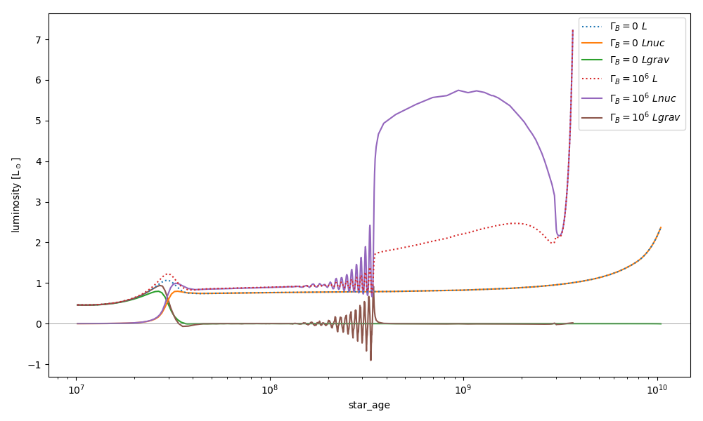
<!-- fe plot luminosities v age -->

#### check conservation of energy
<!-- fs  -->
```python
hdf_dict = {'0': h0df.loc[h0df.star_age>1e7,:], '10^6': hdf.loc[hdf.star_age>1e7,:]}
plot_lum_excess(hdf_dict, save=sd+'Lexcess.png')
plot_energy_cons_error(hdf_dict, title='', save=sd+'rel_energy_error.png') # compare to Paxton19_Fig25.png
```

Energy is not well conserved:

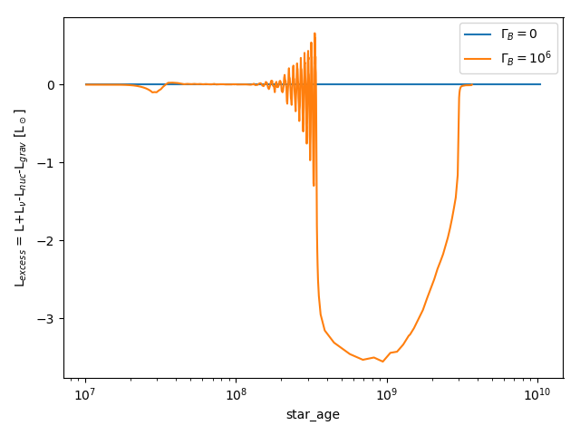 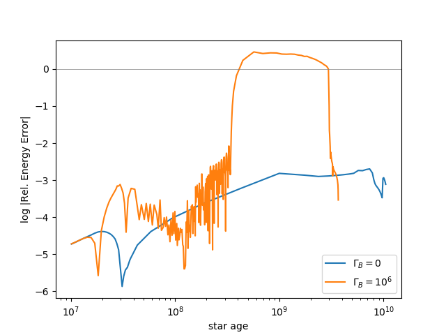

<!-- fe check conservation of energy -->

<!-- fe run: _gold_false -->


<!-- fe # Results from newest MESA version (r12115) -->
