<!-- data below was generated using `./bash_scripts/run_osiris.sh` -->
```python
%run largeLH_data_fncs
hdf, pidf, h0df, pi0df = load_main_data()
```

--------------------------------------------------------------------------------
__This branch is used to investigate why L < LH in the m1p0c6 model, as seen here:__
<!-- fs -->
```python
# hog_path = mesaruns + '/RUNS_2test_final/c6/m1p00/LOGS/history.data'
hog_path = mesaruns + '/RUNS_2test_final/plotsdata/mass1p00/LOGSc6/history.data'
hogdf = pd.read_csv(hog_path, header=4, sep='\s+').set_index('model_number', drop=False)
lums = ['age', 'L','LH','Lnuc','extra_L']
dicog = lums_dict(hogdf.loc[hogdf.star_age<3e9,:], lums)
plot_lums_history(dicog, title='Original Run: m1p0c6')

dicog = lums_dict(hogdf.loc[hogdf.star_age>3e9,:], lums)
plot_lums_history(dicog, title='Original Run: m1p0c6')
lums = ['age', 'L','LH','extra_L'] # exclude Lnuc to see what the others do
dicog = lums_dict(hogdf.loc[hogdf.star_age>3e9,:], lums)
plot_lums_history(dicog, title='Original Run: m1p0c6')
```
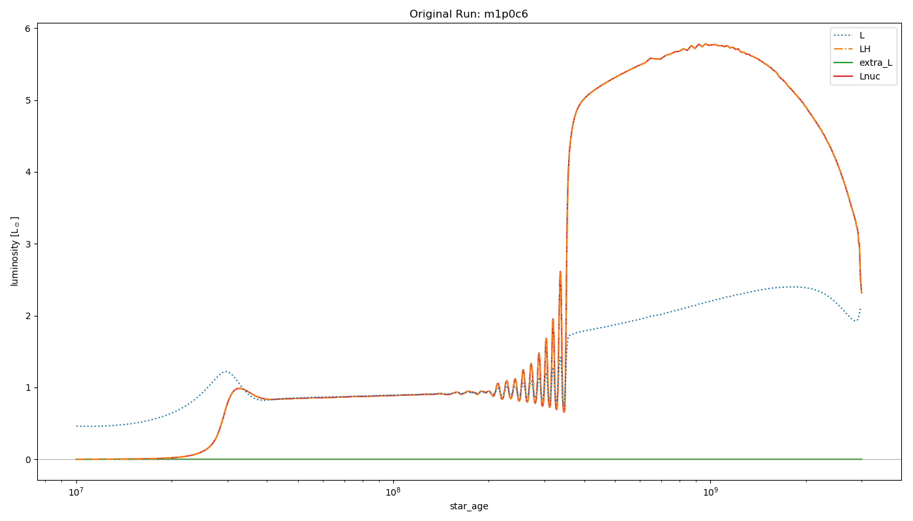

In the process of making the above plot I realized that the luminosity goes completely crazy at the very end of the run.

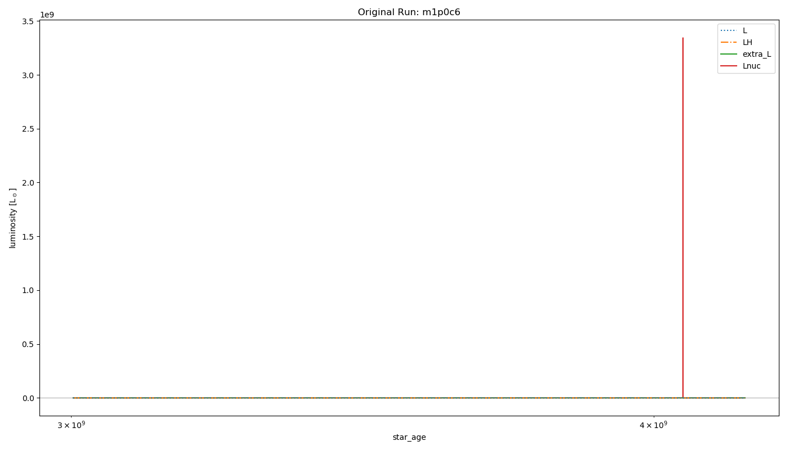
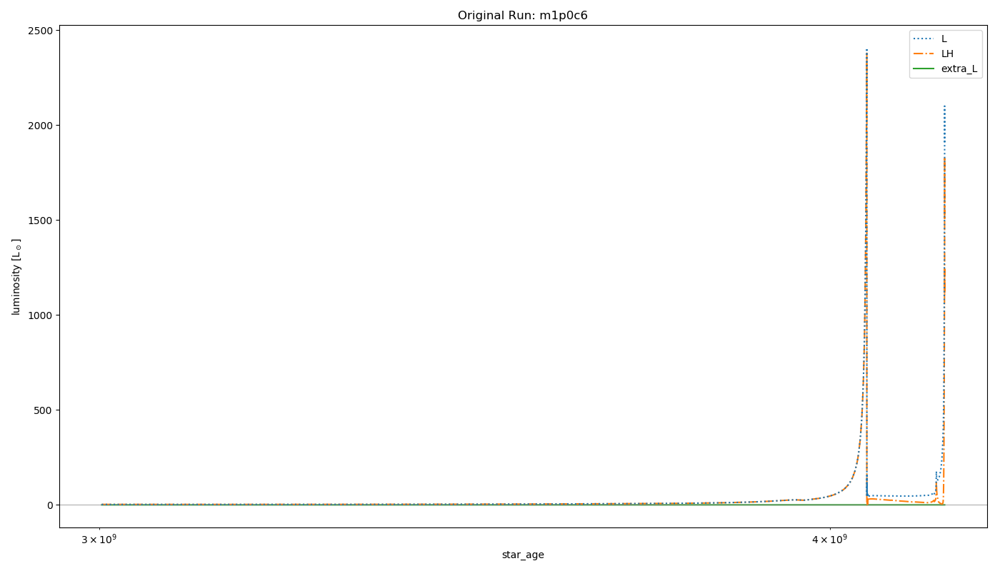
--------------------------------------------------------------------------------
<!-- fe og problem -->


# Results from older MESA version (r10398)
<!-- fs -->
## which timesteps have profiles? (and plot lum v age)
<!-- fs  -->
```python
lums = ['age','L','Lnuc','Lgrav','Ltneu']
dic = lums_dict(hdf, lums)

plot_lums_history(dic, profiles='all')

# profile numbers to load to df
# pidf.loc[((pidf.star_age>3e8) & (pidf.star_age<4e8)),:]
pnums4df = [65,66,71,72,73,74,76,79] #***--- NEEDED TO PLOT LUMINOSITY PROFILES ---***#
plot_lums_history(dic, profiles=pnums4df, hdf=hdf)
```

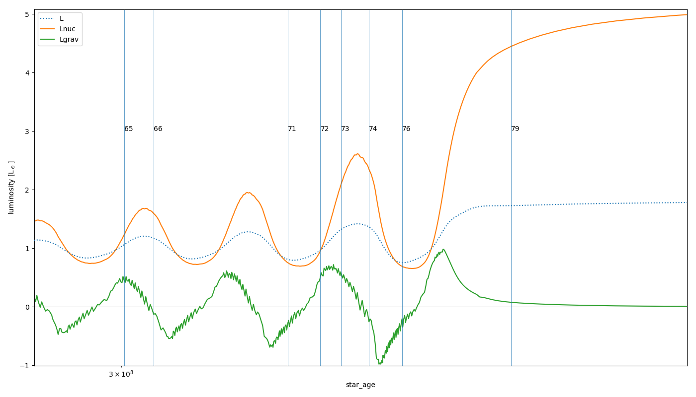

<!-- fe which timesteps have profiles? -->


## plot luminosities v age
<!-- fs  -->
```python
lums = ['age','L','Lneu','Lnuc','Lgrav']
dic = lums_dict(hdf, lums)
plot_lums_history(dic)
```
<!-- fe plot luminosities v age -->


## plot luminosity profiles
<!-- fs  -->
```python
# load profiles to df
# get pnums4df from 'which timesteps have profiles?' section
pdf = load_profiles_df(pnums4df)
# plot
d = plot_lums_profiles(pdf, hdf=hdf)
```
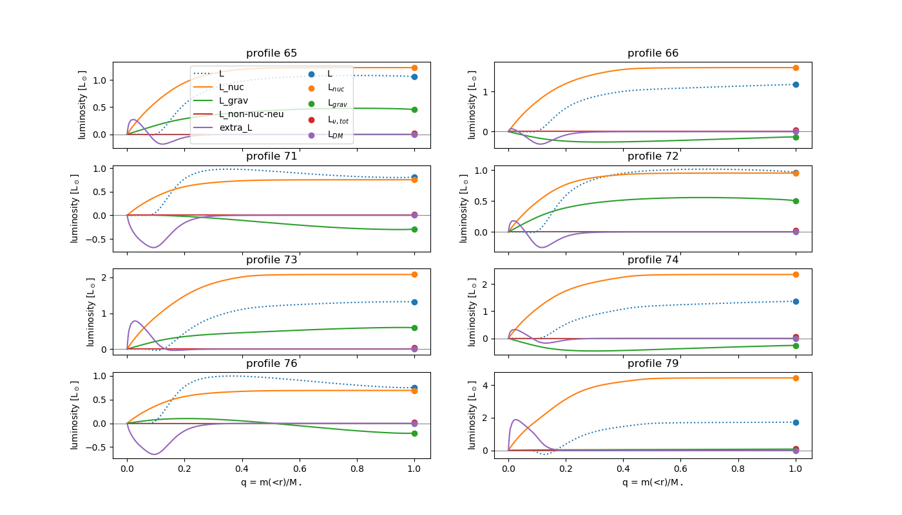
<!-- fe plot luminosity profiles -->

## plot temperatures
<!-- fs  -->
```python
plot_T_profiles(pdf)
```
<!-- fe plot temperatures -->


## check conservation of energy
<!-- fs  -->
```python
hdf_dict = {'0': h0df.loc[h0df.star_age>1e7,:], '10^6': hdf.loc[hdf.star_age>1e7,:]}
plot_lum_excess(hdf_dict)
plot_energy_cons_error(hdf_dict, title='') # compare to Paxton19_Fig25.png
```

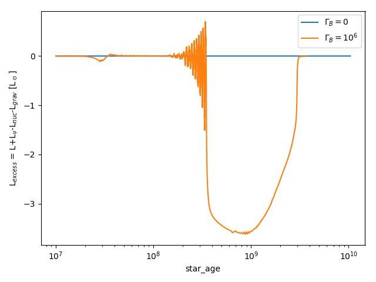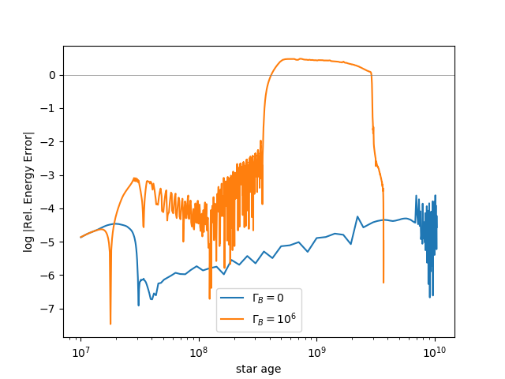

Compare the Rel. Energy Error plot with Paxton19 Fig 25:


__The problem seems to be that energy is simply not conserved sufficiently well.
Need to install latest MESA version (which includes an update that significantly
improves energy conservation) and run these again.__

<!-- fe check conservation of energy -->

<!-- fe # Results from older MESA version (r10398) -->
-----------------------------------------------------------------------------


# Results from newest MESA version (r12115)
<!-- fs -->
The following were done with inlist options:
```
use_dedt_form_of_energy_eqn = .true.
use_gold_tolerances = .true.
!which_atm_option = 'simple_photosphere' (uses default, 'simple_photosphere' does not work in this version of MESA)
```
_The data dirs have been moved to_ `m1p0\_dedt\_gold`. _Paths in_ `largeLH_data_fncs.py` _need to be updated to run this again._ I stopped the c6 run early to try other settings.

## which timesteps have profiles? (and plot lum v age)
<!-- fs  -->
```python
lums = ['age','L','Lnuc','Lgrav','Ltneu']
lums = ['age', 'L','LH','Lnuc','Lneu','Lgrav','Ltneu','extra_L']
dic = lums_dict(hdf, lums)
plot_lums_history(dic, profiles='all', hdf=hdf)

# profile numbers to load to df
# pidf.loc[((pidf.star_age>3e8) & (pidf.star_age<4e8)),:]
pnums4df = [8,10,2,1] #***--- NEEDED TO PLOT LUMINOSITY PROFILES ---***#
plot_lums_history(dic, profiles=pnums4df, hdf=hdf, title='c6')

p0nums4df = [30,32,34,36,41] #***--- NEEDED TO PLOT LUMINOSITY PROFILES ---***#
dic0 = lums_dict(h0df, lums)
plot_lums_history(dic0, profiles=p0nums4df, hdf=h0df, title='c0')

```
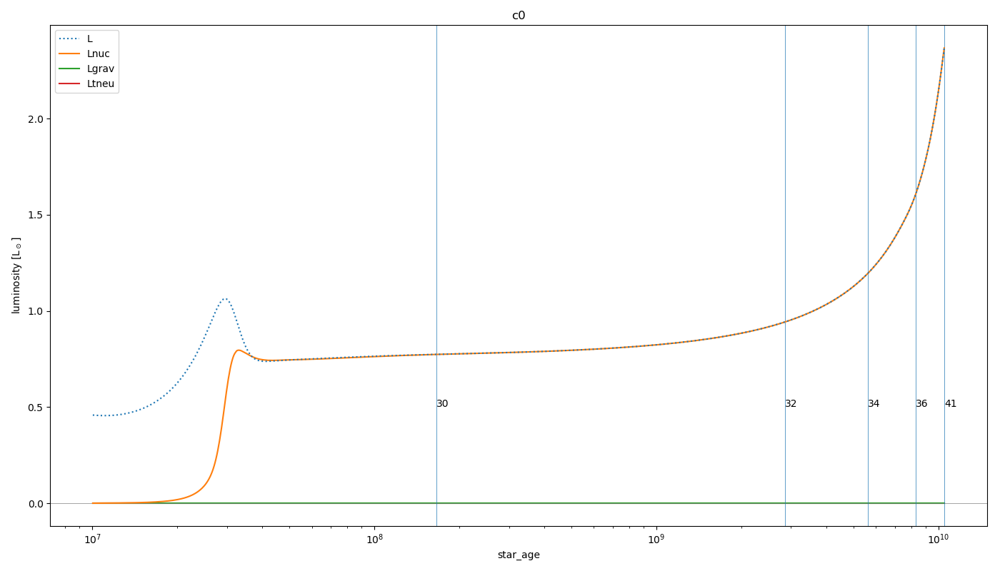
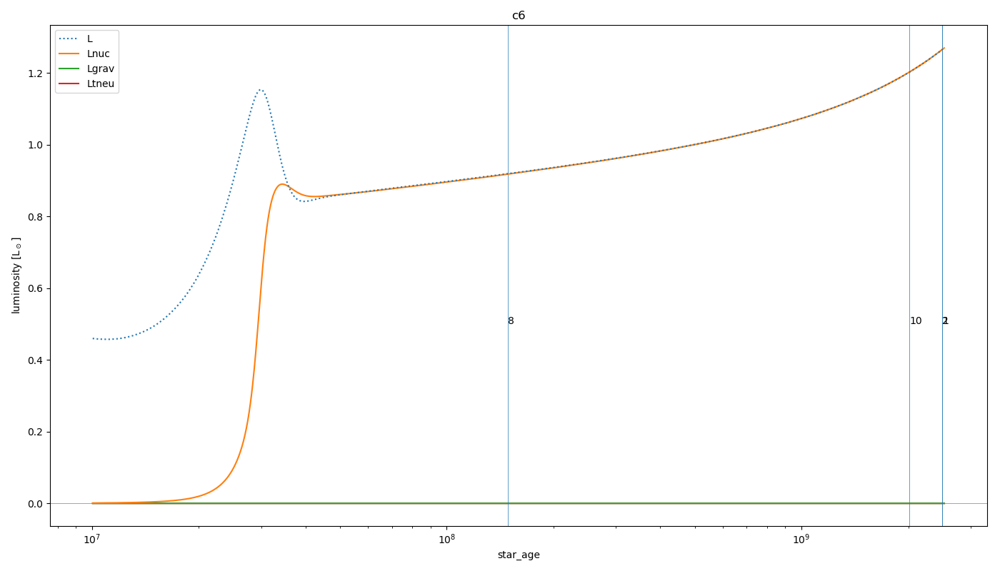

__Note Lgrav is now 0 throughout.__ Not sure what has changed in calculating Lgrav in this version of MESA. This uses history column `eps_grav_integral`. There is also a column `total_eps_grav` that I haven't saved here, but will save and check in future runs.

<!-- fe which timesteps have profiles? -->

## plot luminosities v age
<!-- fs  -->
```python
lums = ['age','L','Lneu','Lnuc','Lgrav']
dic = lums_dict(hdf, lums)
plot_lums_history(dic)

# plot both c0, c6 together
lums = ['age','L','Lnuc','Lgrav']
dic6 = lums_dict(hdf, lums)
dic0 = lums_dict(h0df, lums)
dic = {'0': dic0, '10^6': dic6}
plot_lums_history_06(dic)

```
<!-- fe plot luminosities v age -->

## plot luminosity profiles
<!-- fs  -->
```python
# load profiles to df
# get pnums4df from 'which timesteps have profiles?' section
pdf = load_profiles_df(pnums4df, cb=6)
d = plot_lums_profiles(pdf, hdf=hdf, title='c6')

p0df = load_profiles_df(p0nums4df, cb=0)
d0 = plot_lums_profiles(p0df, hdf=h0df, title='c0')
```
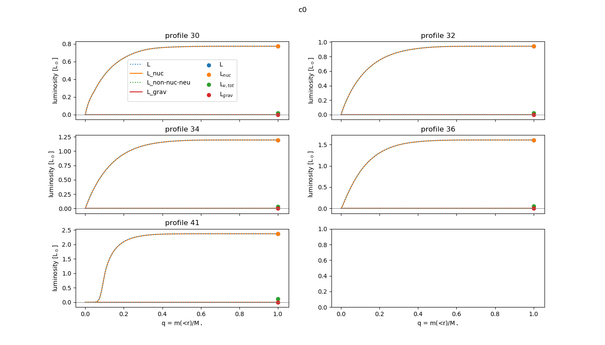
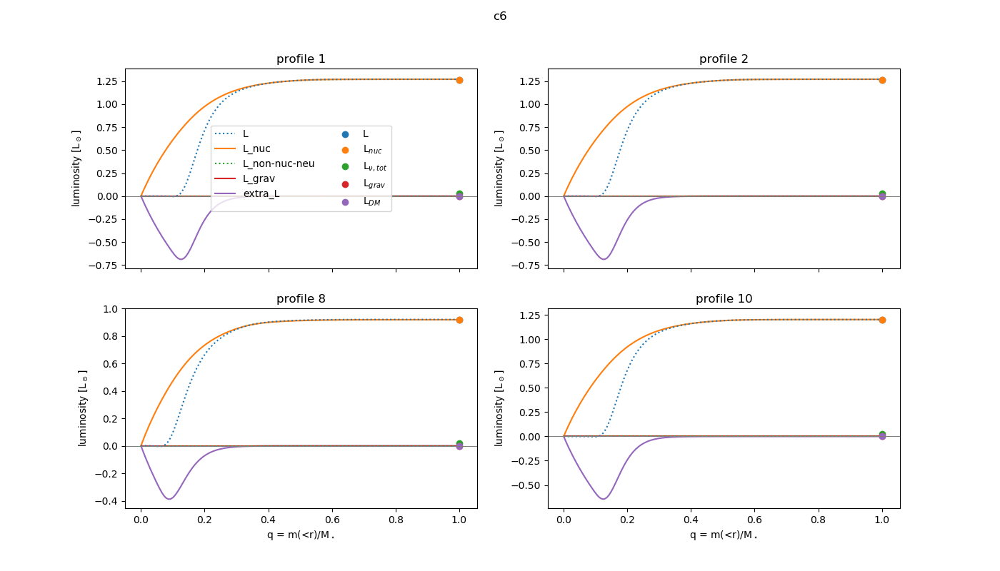

<!-- fe plot luminosity profiles -->

## check conservation of energy
<!-- fs  -->
```python
hdf_dict = {'0': h0df.loc[h0df.star_age>1e7,:], '10^6': hdf.loc[hdf.star_age>1e7,:]}
plot_lum_excess(hdf_dict)
plot_energy_cons_error(hdf_dict, title='') # compare to Paxton19_Fig25.png
```

 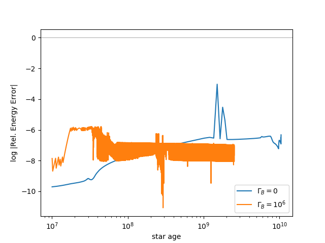

__Physical energy does not seem to be conserved during pre-ZAMS since Lgrav is 0 (see above). Relative energy error is now acceptably low.__ (Compare to Paxton19_Fig25 above. I believe the relative energy error is _numerical_ energy error. This uses history column `error_in_energy_conservation`, see [this mailing list question](https://lists.mesastar.org/pipermail/mesa-users/2015-November/005921.html) and equation 57 in MESA paper 3 (Paxton 2015))

<!-- fe check conservation of energy -->

## plot other history columns
<!-- fs  -->
```python
hdf_dict = {'0': h0df.loc[h0df.star_age>1e7,:], '10^6': hdf.loc[hdf.star_age>1e7,:]}

plot_burning_06(hdf_dict)
plot_center_abundances(hdf_dict)

```
<!-- fe ## plot other history columns -->

## plot other profiles
<!-- fs  -->
```python
# pnums4df = list(np.arange(1,21))
# pnums4df = [8,10,16,5]
# pdf = load_profiles_df(pnums4df)

plot_Tx_minus_T_profiles(pdf)
plot_convection(pdf)
plot_T_profiles(pdf, title='c6')
plot_T_profiles(p0df, title='c0')
plot_eps_profiles(pdf, title='c6')
plot_eps_profiles(p0df, title='c0')
plot_abundance_profiles(pdf, title='c6')
plot_abundance_profiles(p0df, title='c0')
plot_nx_profiles(pdf, title='c6')
plot_rho_profiles(pdf, title='c6')
```

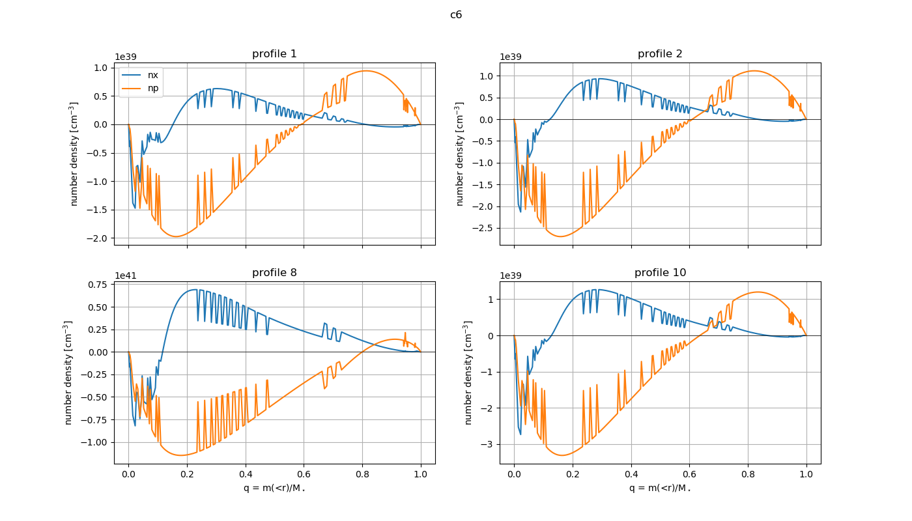

__nx and np are negative... this doesn't make any sense.__ These are values I am calculating. I have looked at my code and I don't understand how this is happening. nx is a normalization factor (common to every cell) multiplied by an exponential, and should therefore always be positive (or at least all cells should be either positive or negative together). np is the hydrogen mass fraction times the density divided by the mass of a proton, and should therefore always be positive.

<!-- fe plot other profiles -->


------------------------------------------------------------------------------
The following were done with the __new MESASDK__ and __default inlist options__:
```
!use_dedt_form_of_energy_eqn = .true.
!use_gold_tolerances = .true.
!which_atm_option = 'simple_photosphere' (uses default, 'simple_photosphere' does not work in this version of MESA)
```

## which timesteps have profiles? (and plot lum v age)
<!-- fs  -->
```python
lums = ['age','L','Lnuc','Lgrav','Ltneu']
lums = ['age', 'L','LH','Lnuc','Lneu','Lgrav','Ltneu','extra_L']
dic = lums_dict(hdf, lums)
plot_lums_history(dic, profiles='all', hdf=hdf)

# profile numbers to load to df
# pidf.loc[((pidf.star_age>3e8) & (pidf.star_age<4e8)),:]
pnums4df = [10,13,1,12] #[8,11,1,13,4]
plot_lums_history(dic, profiles=pnums4df, hdf=hdf, title='c6')

p0nums4df = #[30,32,34,36,41]
dic0 = lums_dict(h0df, lums)
plot_lums_history(dic0, profiles=p0nums4df, hdf=h0df, title='c0')
```
<!-- fe ## which timesteps have profiles? (and plot lum v age) -->

## plot luminosity profiles
<!-- fs  -->
```python
# load profiles to df
# get pnums4df from 'which timesteps have profiles?' section
pdf = load_profiles_df(pnums4df, cb=6)
d = plot_lums_profiles(pdf, hdf=hdf, title='c6')

p0df = load_profiles_df(p0nums4df, cb=0)
d0 = plot_lums_profiles(p0df, hdf=h0df, title='c0')
```
<!-- fe ## plot luminosity profiles -->

## plot other profiles
<!-- fs -->
```python
plot_nx_profiles(pdf, title='c6', log=False)
```
<!-- fe plot other profiles -->

<!-- fe # Results from newest MESA version (r12115) -->
