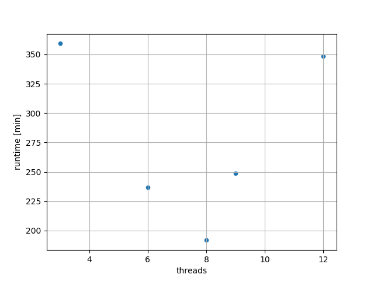

__Looks like ~8 threads is ideal. Have set `OMP_NUM_THREADS=8` in bash profile.__

# Test varying OMP_NUM_THREADS

- [x]  Set up `run_osirisRTT.sh` to do m1p25c6 # tried m0p8 and m1p0 but took too long
- [x]  Set up `run_osirisRTT_caller.sh` to do 3 simultaneous runs
- [x]  Add stopping condition to `defDM` inlist: `xa_central_lower_limit_species(1) = 'h1', xa_central_lower_limit(1) = 0.65`

```bash
# test 12, 9, 8, 6, 3 for OMP_NUM_THREADS
cd bash_scripts
nohup nice ./run_osirisRTT_caller.sh "_default_plus_DM" 8
```

All of these ran on Osiris wnode3 with 3 other ./star running (from runSettings branch) using 12 threads each, except `threads8` had only 2 other .star's running.


# Look at data

```python
%run fncs
rcdf, pidf = load_all_data(dr=dr, rk='_default_plus_DM')
plot_avg_runtimes(rcdf, save='runtimes.png')

```


